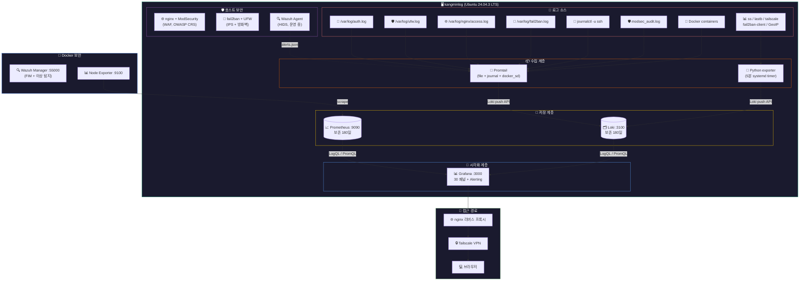
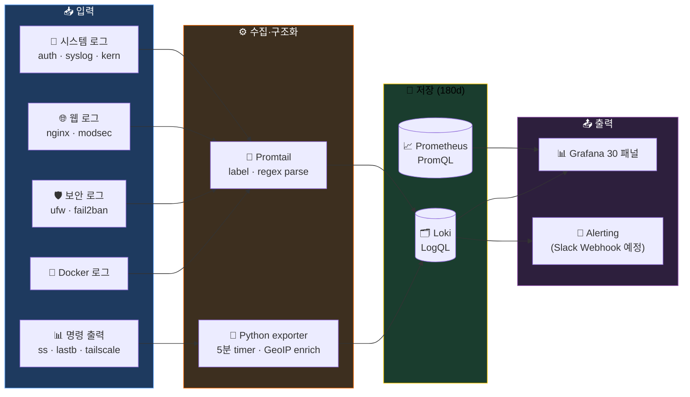
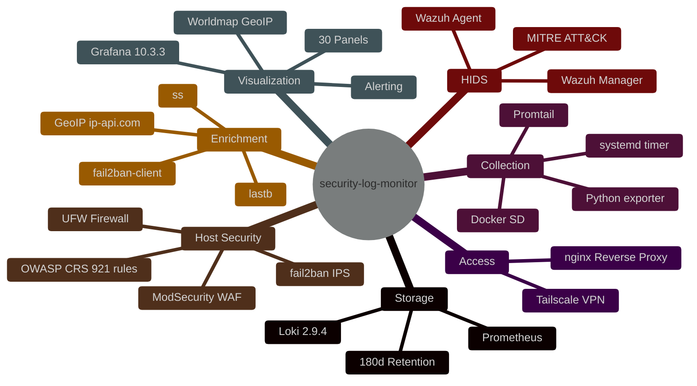
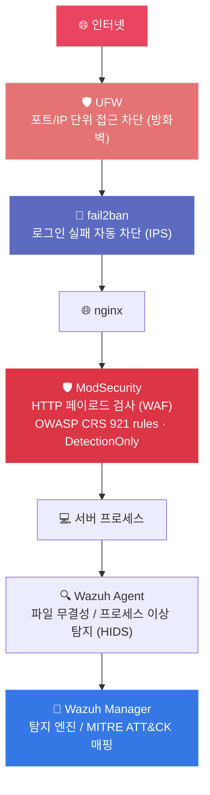
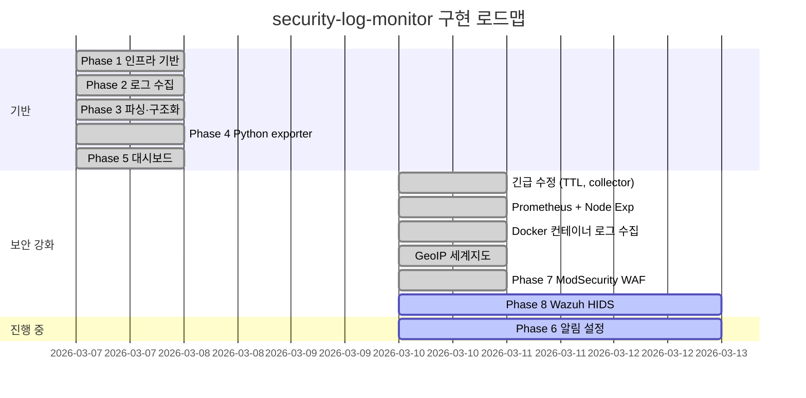

> 📦 이 폴더는 **[SIEM-Trinity](../README.md)** 모노레포의 **01-collection** 레이어입니다. 통합 아키텍처는 루트 README를, 다른 레이어는 [`02-detection/`](../02-detection/) · [`03-intelligence/`](../03-intelligence/) 참조.

<div align="center">

<!-- Hero Banner -->


<br/>

# security-log-monitor

### 홈서버 기반 엔터프라이즈급 SIEM 스택

**리눅스 커널 + 오픈소스만으로**
**수백만 원짜리 보안 장비 없이 실시간 로그 수집·파싱·시각화·알림을 구현합니다**

<br/>

<!-- Core Value Propositions -->
`📡 15+ 로그 소스 통합 수집` &nbsp;
`🗺️ GeoIP 공격 세계지도` &nbsp;
`🛡️ 5계층 보안 (UFW→f2b→WAF→HIDS)` &nbsp;
`📊 30+ Grafana 패널`

<br/>

<!-- Tech Badges -->
[](https://grafana.com/oss/loki/)
[](https://grafana.com/docs/loki/latest/send-data/promtail/)
[](https://grafana.com)
[](https://prometheus.io)
[](https://wazuh.com)
[](https://modsecurity.org)
[](https://www.fail2ban.org)
[](https://tailscale.com)

<br/>

<!-- Status Badges -->


</div>

---

> [!NOTE]
> **security-log-monitor**는 홈서버(`kangminlog`, Ubuntu 24.04.3 LTS) 한 대에 엔터프라이즈급 SIEM을 오픈소스로 구축하는 프로젝트입니다.
> Loki + Promtail + Grafana + Prometheus + Wazuh + ModSecurity + fail2ban + UFW + Tailscale 조합으로 **유료 솔루션 0원** 운영합니다.

> [!CAUTION]
> Tailscale 네트워크 내부에서만 접근 가능 (공인 IP 완전 차단).
> Grafana Admin 비밀번호는 `.env` 의 `GF_ADMIN_PASSWORD` 로만 주입됩니다. 미설정 시 스택이 기동하지 않습니다.

---

## 📑 목차

<table>
<tr>
<td width="50%">

- [📊 현재 스택 현황](#-현재-스택-현황)
- [🏗️ 아키텍처](#️-아키텍처)
- [🔄 데이터 흐름](#-데이터-흐름)
- [🛠 기술 스택](#-기술-스택)
- [📡 수집 대상 로그](#-수집-대상-로그)
- [🛡️ 보안 레이어 구조](#️-보안-레이어-구조)

</td>
<td width="50%">

- [📈 Grafana 대시보드](#-grafana-대시보드)
- [🔔 알림 임계값 (Phase 6)](#-알림-임계값-phase-6)
- [🚀 접근 방법](#-접근-방법)
- [🛣️ 구현 로드맵](#️-구현-로드맵)
- [⚠️ 트러블슈팅](#️-트러블슈팅)
- [📚 관련 문서](#-관련-문서)

</td>
</tr>
</table>

---

## 🛡️ XDR 통합 (epic #4 완료)

`docker-compose.yml` 에 **3개 profile 추가** — 기본 `docker compose up` 에는 미포함, 옵트인.

| Profile | 컨테이너 | 단계 | 활성화 |
|---|---|---|---|
| `misp` | misp-core + misp-db + misp-redis | XDR 단계 4 | `docker compose --profile misp up -d` |
| `shuffle` | shuffle-{opensearch,backend,frontend,orborus} | XDR 단계 5 | `--profile shuffle` |
| `thehive` | thehive-{cassandra,elasticsearch,app} | XDR 단계 6 | `--profile thehive` |

**한 번에 모두**: 루트의 `./xdr-up.sh` 가 위 세 profile 동시 활성화 + API 자동 부트스트랩.

---

## 📊 현재 스택 현황

| 컴포넌트 | 버전 | 역할 | 상태 |
|----------|:----:|------|:----:|
| **Loki** | 2.9.4 | 로그 저장 및 LogQL 쿼리 | ✅ 운영 중 |
| **Promtail** | 2.9.4 | 파일 / journal / Docker 로그 수집 | ✅ 운영 중 |
| **Grafana** | 10.3.3 | 대시보드 (30패널, 카테고리 재배치) + 알림 | ✅ 운영 중 |
| **Prometheus** | latest | 시스템 메트릭 수집·저장 (보존 180일) | ✅ 운영 중 |
| **Node Exporter** | latest | CPU / 메모리 / 디스크 메트릭 | ✅ 운영 중 |
| **Wazuh Manager** | 4.14.3 | HIDS — 파일 무결성 / 이상 프로세스 탐지 | ✅ 운영 중 (agent 등록 현황은 `docker exec wazuh-manager /var/ossec/bin/agent_control -l` 로 확인) |
| **nginx** | — | 리버스 프록시 + ModSecurity WAF | ✅ 운영 중 |
| **ModSecurity** | — | WAF (OWASP CRS 921개 규칙, DetectionOnly) | ✅ 운영 중 |
| **fail2ban** | — | IPS — 로그인 실패 자동 차단 | ✅ 운영 중 |
| **UFW** | — | 방화벽 — 포트 / IP 접근 제어 | ✅ 운영 중 |
| **Tailscale** | — | VPN mesh — 원격 안전 접근 | ✅ 운영 중 |
| **Python exporter** | 3.x | ss / fail2ban-client / lastb / GeoIP / nginx access enrichment | ✅ 운영 중 |

---

## 🏗️ 아키텍처



---

## 🔄 데이터 흐름



---

## 🛠 기술 스택



### 환경 사양

| 항목 | 사양 |
|------|------|
| Host | `kangminlog` |
| OS | Ubuntu 24.04.3 LTS |
| Loki / Prometheus | 보존 180일 |
| 접근 | Tailscale VPN (`http://100.x.x.x:3000`) |

---

## 📡 수집 대상 로그

| 대분류 | 소스 | 경로 / 명령 | 수집 방식 | 파싱 필드 |
|--------|------|------------|-----------|-----------|
| **운영체제** | auth.log | `/var/log/auth.log` | Promtail file | `action`, `username`, `src_ip` |
| | syslog | `/var/log/syslog` | Promtail file | — |
| **웹서비스** | nginx access | `dodgers-nginx-1 stdout` | Python exporter | `remote_addr`, `request_path`, `status_code`, `user_agent`, `client_type` |
| | nginx error | `/var/log/nginx/error.log*` | Promtail file | — |
| **WAF** | ModSecurity | `/var/log/nginx/modsec_audit.log` | Promtail file | `rule_id`, `modsec_action`, `msg` |
| **시스템보안** | ufw | `/var/log/ufw.log*` | Promtail file | `ufw_action`, `src_ip`, `proto`, `dpt` |
| | 커널 방화벽 차단 (`KR-BLOCK`) | `/var/log/kern.log` | Promtail file | `kern_event`, `src_ip`, `dst_ip`, `proto`, `dpt` |
| | fail2ban | `/var/log/fail2ban.log` | Promtail file | `jail`, `f2b_action`, `banned_ip` |
| | SSH 서비스 | `journalctl -u ssh` | Promtail journal | — |
| **인프라** | Docker 컨테이너 | `/var/lib/docker/containers` | Promtail docker_sd | `container`, `stream` |
| **네트워크** | 포트 현황 | `ss -tulpen` | Python exporter | — |
| | fail2ban 상태 | `fail2ban-client status sshd` | Python exporter | — |
| | 로그인 실패 이력 | `lastb` | Python exporter | — |
| | GeoIP | ip-api.com (fail2ban 차단 IP) | Python exporter | `lat`, `lon`, `country`, `city` |
| | Tailscale | `tailscale status` | Python exporter | — |

---

## 🛡️ 보안 레이어 구조



---

## 📈 Grafana 대시보드

> 핵심 16+개 패널. 데이터소스는 Loki(LogQL) / Prometheus(PromQL) 혼합.

| # | 패널명 | 데이터소스 | 비고 |
|:--:|--------|:----------:|------|
| 1 | SSH Invalid user 시도 타임라인 | Loki | |
| 2 | fail2ban Ban/Unban 이벤트 | Loki | |
| 3 | KR-BLOCK 차단 이벤트 타임라인 | Loki | 커널 로그 기반 |
| 4 | Nginx 상태코드 분포 | Loki | |
| 5 | Top 공격 IP 테이블 | Loki | |
| 6 | 최근 로그인 실패 이력 (lastb) | Loki | |
| 7 | 포트 노출 현황 (ss) | Loki | |
| 8 | fail2ban 차단 현황 | Loki | |
| 9 | 🗺️ **공격 발신지 세계지도 (GeoIP)** | Loki | ip-api.com batch API |
| 10 | CPU 사용률 | Prometheus | 5분 평균 |
| 11 | 메모리 사용률 | Prometheus | |
| 12 | 디스크 사용률 `/` | Prometheus | 임계값 70% / 90% |
| 13 | 웹 방문 IP / 요청 수 / 국가 테이블 | Loki | `nginx_visitors_geo` |
| 14 | 웹 방문 유형 분포 | Loki | `browser/scanner/internal/script` |
| 15 | 최근 스캐너 의심 요청 | Loki | `request_path`, `status_code`, `UA` |
| 16 | Suricata IDS 패널 묶음 | Loki | 심각도 / 시그니처 / Top IP |

<details>
<summary><b>📅 2026-03-12 변경 사항</b></summary>

- `Nginx 상태코드 분포 (24h)` 패널의 Loki 구문 오류를 제거하고 `nginx_recent_access` 기반 쿼리로 교체
- `Python exporter`가 `dodgers-nginx-1` access 로그를 직접 읽어 `nginx_access_enriched` 로그를 Loki로 푸시
- `웹 방문자 세계지도`는 공인 IP만 대상으로 표시하도록 정리
- `웹 방문 IP 목록`을 로그 패널에서 `IP / 요청 수 / 국가 / 유형 / UA` 테이블로 변경
- `웹 방문 유형 분포 (24h)` 패널 추가
- `최근 스캐너 의심 요청` 패널 추가

</details>

<details>
<summary><b>📅 2026-03-13 변경 사항</b></summary>

- 대시보드를 `실시간 요약 / 조사 / 시스템 / 네트워크 센서` 순서로 재배치
- 상단 핵심 패널은 집계형 쿼리로 단순화 (`SSH`, `fail2ban`, `UFW`, `nginx`)
- 조사성 패널(`Top`, `분포`, 일부 테이블)은 `instant` 쿼리로 변경해 Loki range fan-out 감소
- `Wazuh` 패널을 high severity(`level >= 7`) 중심으로 정리하고 잘못된 비교식 쿼리 제거
- 신규 패널 추가:
  - `ModSecurity 이벤트 추이 (24h)`
  - `ModSecurity Top Rule (24h)`
  - `Top 차단 목적지 포트 (UFW 24h)`
  - `Tailscale 연결 상태`
- Loki 단일 노드 환경에 맞춰 query pressure 완화:
  - `frontend.max_outstanding_per_tenant`
  - `query_scheduler.max_outstanding_requests_per_tenant`
  - `limits_config.split_queries_by_interval`
  - `querier.max_concurrent`

</details>

---

## 🔔 알림 임계값 (Phase 6)

> Slack Webhook 대기 중. `.env`에 `SLACK_WEBHOOK_URL` 설정 후 Grafana Contact Point 등록 예정.

| 규칙명 | 조건 (5분 윈도우) | 심각도 |
|--------|-----------------|:------:|
| SSH 브루트포스 감지 | "Invalid user" ≥ 50건 | 🔴 긴급 |
| fail2ban 차단 급증 | Ban 이벤트 ≥ 10건 | 🟡 경고 |
| Nginx 5xx 급증 | 5xx 에러 ≥ 20건 | 🟡 경고 |

> [!NOTE]
> Outlook SMTP는 Microsoft 정책으로 인증 불가. **Slack Incoming Webhook으로 전환** 결정.

---

## 🚀 접근 방법

```
Tailscale VPN → http://100.x.x.x:3000  (Grafana 직접)
```

> [!IMPORTANT]
> Tailscale 네트워크 내부에서만 접근 가능 (공인 IP 완전 차단).

---

## 🛣️ 구현 로드맵



---

## ⚠️ 트러블슈팅

> [!WARNING]
> **Loki 컨테이너 재시작 반복 (Phase 1)**
> 원인: WAL 경로 `/wal` 권한 없음
> 해결: `loki-config.yml`에 `ingester.wal.dir: /loki/wal` 명시

> [!CAUTION]
> **Promtail → Loki 429 오류 (Phase 1)**
> 원인: 최초 기동 시 대용량 기존 로그 한꺼번에 전송
> 해결: `limits_config`에 `ingestion_rate_mb: 32`, `ingestion_burst_size_mb: 64` 추가

> [!WARNING]
> **fail2ban-client / lastb 권한 오류 (Phase 4)**
> 원인: root 권한 필요, exporter는 일반 사용자(`user`)로 실행
> 해결: `/etc/sudoers.d/security-log-exporter`에 NOPASSWD 예외 추가

> [!TIP]
> **`docker-compose.yml` 볼륨/포트 변경 후 적용**
> `docker compose restart`가 아닌 반드시 아래 명령을 사용:
> ```bash
> docker compose up -d --force-recreate <서비스명>
> ```

> [!WARNING]
> **Wazuh Manager 버전 불일치 (Phase 8)**
> Manager 4.7.0 + Agent 4.14.3 조합으로 인증 오류 발생
> 해결: Manager 4.14.3으로 교체, `filebeat.yml` 마운트 필요

---

## 📚 관련 문서

<details>
<summary><b>🗺️ 계획 / 로드맵</b></summary>

| 문서 | 내용 |
|------|------|
| [docs/planning/roadmap.md](docs/planning/roadmap.md) | 현재 구현 현황 + 향후 우선순위 |
| GitHub Issue #4 | XDR 6단계 epic (기능 추가·개선 단일 트래커) |

</details>

<details>
<summary><b>🛠 운영 가이드</b></summary>

| 문서 | 내용 |
|------|------|
| [docs/guides/phase6-alerting-guide.md](docs/guides/phase6-alerting-guide.md) | Grafana 알림 설정 (Slack / Email) |
| [docs/guides/nginx-reverse-proxy-guide.md](docs/guides/nginx-reverse-proxy-guide.md) | nginx 리버스 프록시 설정 |
| [docs/guides/network-security-guide.md](docs/guides/network-security-guide.md) | Docker UFW 우회 문제 및 포트 보안 |
| [docs/guides/snort-overview.md](docs/guides/snort-overview.md) | Snort vs 현재 스택 비교 |

</details>

<details>
<summary><b>🏛️ 아키텍처</b></summary>

| 문서 | 내용 |
|------|------|
| [docs/architecture/stack-comparison.md](docs/architecture/stack-comparison.md) | security-log-monitor vs otel_project 상세 비교 |
| [docs/architecture/gap-analysis.md](docs/architecture/gap-analysis.md) | 보안 스택 공백 분석 (Trivy, Suricata 도입 검토) |
| [docs/architecture/attacker-to-host-detection-flow.md](docs/architecture/attacker-to-host-detection-flow.md) | 공격자 진입 기준 탐지/로그 데이터 흐름도 (Mermaid) |
| [docs/architecture/zeek-suricata-observability-design.md](docs/architecture/zeek-suricata-observability-design.md) | Zeek + Suricata 네트워크 가시성 설계안 |
| [docs/architecture/zeek-observability-gain.md](docs/architecture/zeek-observability-gain.md) | Zeek 도입 시 가시성 이득 분석 |
| [docs/architecture/visibility-gap-and-roadmap.md](docs/architecture/visibility-gap-and-roadmap.md) | 현재 가시성 현황 및 90%+ 달성 로드맵 |
| [docs/knowledge/owasp-top10-coverage.md](docs/knowledge/owasp-top10-coverage.md) | OWASP Top 10 항목별 현재 방어 수준 평가 |

</details>

<details>
<summary><b>📖 도메인 지식</b></summary>

| 문서 | 내용 |
|------|------|
| [docs/knowledge/security-domain-map.md](docs/knowledge/security-domain-map.md) | 보안 3대 영역 (Offensive / Engineering / IR) |
| [docs/knowledge/security-solutions-concepts.md](docs/knowledge/security-solutions-concepts.md) | EDR / XDR / SIEM / SOAR 개념 정리 |
| [docs/knowledge/security-career-paths.md](docs/knowledge/security-career-paths.md) | 보안 직업군 및 진입 경로 |
| [docs/knowledge/curriculum-evaluation.md](docs/knowledge/curriculum-evaluation.md) | 보안 커리큘럼 프로젝트 적용성 평가 |
| [docs/knowledge/tech-stack-licenses.md](docs/knowledge/tech-stack-licenses.md) | 기술 스택 라이센스 현황 |
| [docs/knowledge/security-coverage-frameworks.md](docs/knowledge/security-coverage-frameworks.md) | 보안 커버리지 평가 프레임워크 (MITRE ATT&CK / Kill Chain / CIS / NIST CSF / Pyramid of Pain) |

</details>

---

<div align="center">

**security-log-monitor** · 홈서버 SIEM · 100% 오픈소스 · 0원 운영
Built with **Loki · Promtail · Grafana · Prometheus · Wazuh · ModSecurity · fail2ban · Tailscale**


</div>
