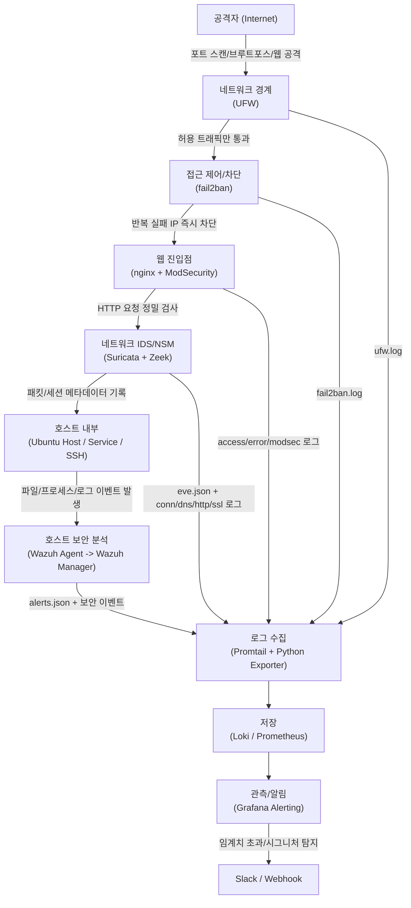
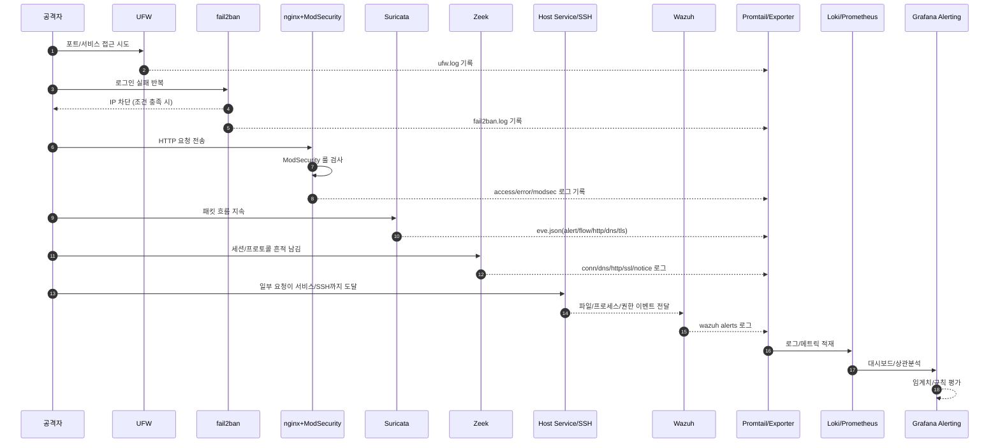

# 공격자 진입 기준 탐지/로그 데이터 흐름도

> GitHub Markdown 렌더링용 (`Mermaid`)
> 작성일: 2026-03-12

---

## 1) 공격자 관점 침투 경로 + 방어 탐지 지점

---

## 2) "뚫고 들어와도 흔적이 남는" 탐지 체인

---

## 3) 한 줄 요약

공격자가 네트워크-웹-호스트를 따라 깊게 들어와도, 각 계층(UFW/fail2ban/ModSecurity/Suricata/Zeek/Wazuh)에서 이벤트가 남고 최종적으로 `Promtail -> Loki/Prometheus -> Grafana`로 모여 추적/알림이 가능하다.
