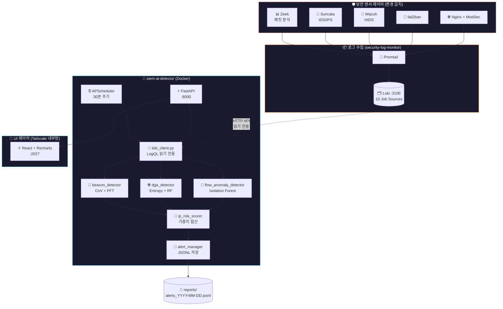
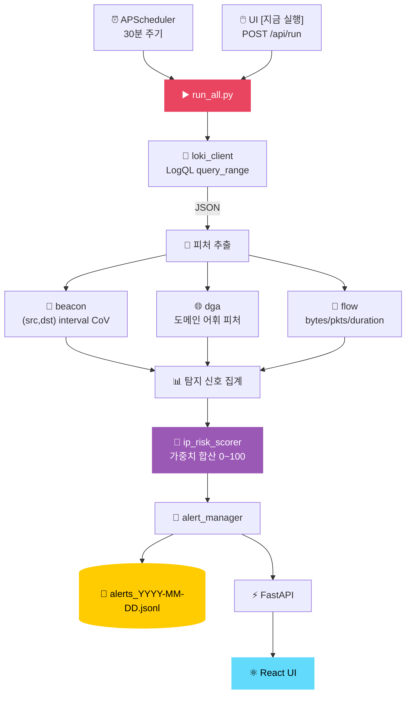
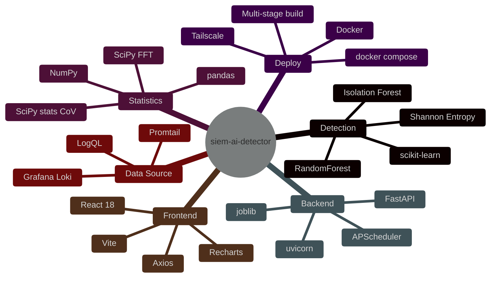
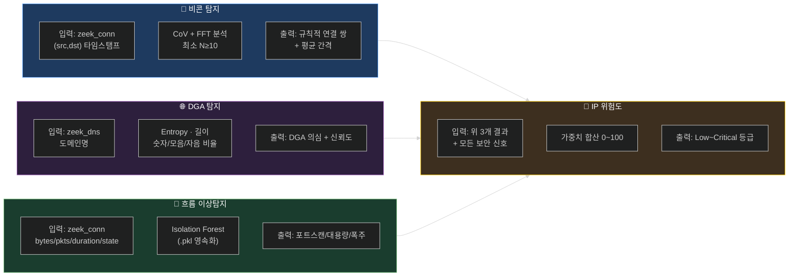

> 📦 이 폴더는 **[SIEM-Trinity](../README.md)** 모노레포의 **02-detection** 레이어입니다. 통합 아키텍처는 루트 README를, 다른 레이어는 [`01-collection/`](../01-collection/) · [`03-intelligence/`](../03-intelligence/) 참조.
>
> ⚠️ **AI 탐지 결과는 JSONL 파일 기록만** 합니다 (`reports/alerts_*.jsonl`). 자동 IP 차단은 **하지 않습니다** — 차단은 호스트의 fail2ban 데몬이 별도로 담당. 검증: `grep -rn "fail2ban-client\|iptables\|block_ip" .` → 차단 호출 없음.

<div align="center">

<!-- Hero Banner -->


<br/>

# siem-ai-detector

### SIEM 로그 기반 AI 위협 탐지 엔진

**Zeek · Suricata · fail2ban · Wazuh 로그를 실시간 분석해**
**비콘 · DGA · 이상 흐름 · IP 위험도를 자동 탐지합니다**

<br/>

<!-- Core Value Propositions -->
`📡 비콘 (CoV+FFT) C2 탐지` &nbsp;
`🌐 DGA 도메인 탐지` &nbsp;
`🔬 Isolation Forest 흐름 이상탐지` &nbsp;
`🎯 IP 위험도 통합 스코어링`

<br/>

<!-- Tech Badges -->
[](https://python.org)
[](https://fastapi.tiangolo.com)
[](https://scikit-learn.org)
[](https://scipy.org)
[](https://react.dev)
[](https://docs.docker.com/compose)
[](https://grafana.com/oss/loki/)

<br/>

<!-- Status Badges -->


</div>

---

> [!NOTE]
> **siem-ai-detector**는 기존 보안 스택(`security-log-monitor`)을 **변경하지 않고**,
> Loki HTTP API를 통해 로그를 **읽기 전용**으로만 수집해 분석합니다.
> 30분 주기 자동 실행 + 즉시 실행 버튼으로 on-demand 분석도 지원합니다.

> [!IMPORTANT]
> **CPU only** — GPU 없이 동작합니다. 4개 탐지기는 scikit-learn / scipy 조합으로 모두 노트북·소형 서버에서 실행 가능합니다.

---

## 📑 목차

<table>
<tr>
<td width="50%">

- [🏗️ 아키텍처](#️-아키텍처)
- [🔄 데이터 흐름](#-데이터-흐름)
- [🛠 기술 스택](#-기술-스택)
- [📁 파일 구조](#-파일-구조)
- [📡 로그 수집 (10 Source)](#-로그-수집-10-source)

</td>
<td width="50%">

- [🧠 4개 탐지기](#-4개-탐지기)
- [🎯 IP 위험도 스코어링](#-ip-위험도-스코어링)
- [🚀 빠른 시작](#-빠른-시작)
- [🔧 환경변수 & 볼륨](#-환경변수--볼륨)
- [🔗 관련 프로젝트](#-관련-프로젝트)

</td>
</tr>
</table>

---

## 🏗️ 아키텍처



### 설계 원칙

| 원칙 | 구현 |
|:----:|------|
| 🔒 **기존 스택 무변경** | Loki HTTP API 읽기 전용. 로그 파일 직접 접근·복사 금지 |
| 💻 **CPU only** | GPU 없이 동작 (scikit-learn, scipy, lightgbm) |
| 🧩 **독립 실행** | 각 탐지기는 단독으로도 실행 가능 (`python beacon_detector.py`) |
| 🐳 **컨테이너 격리** | Docker Compose로 배포, `loki-net` 외부 네트워크에 합류해 Loki 접근 |
| ⏯️ **자동 + 즉시** | APScheduler 30분 주기 + UI [지금 실행] 버튼 / `POST /api/run` |
| 💾 **모델 영속화** | Isolation Forest 학습 결과 `models/*.pkl` 볼륨 보존 |
| 🇰🇷 **한국어 출력** | 모든 경보·결과 한국어 |

---

## 🔄 데이터 흐름



---

## 🛠 기술 스택



<details>
<summary><b>📋 상세 기술 스택 테이블</b></summary>

| Layer | 기술 | 용도 |
|:-----:|------|------|
| **Detection ML** | scikit-learn | Isolation Forest · RandomForest |
| | scipy.stats | CoV (변동계수) — 비콘 규칙성 측정 |
| | scipy.fft | 지배 주파수 분석 — 비콘 강화 검증 |
| | numpy / pandas | 피처 가공 |
| | joblib | 모델 직렬화 (`isolation_forest.pkl`) |
| **Backend** | FastAPI | REST API (`/api/summary`, `/api/alerts`, `/api/run`) |
| | APScheduler | 30분 주기 자동 실행 |
| | uvicorn | ASGI 서버 |
| **Frontend** | React 18 + Vite | UI |
| | Recharts | 바·파이·라인 차트 3종 |
| | Axios | HTTP 클라이언트 |
| **Data Source** | Grafana Loki | LogQL `query_range` API |
| | Promtail | (외부 — 기존 스택) 로그 수집기 |
| **Deploy** | Docker Compose | 멀티스테이지 빌드 (Node → Python) |
| | Tailscale | 내부망 노출 (`100.x.x.x:2027`) |

</details>

### 환경 사양

| 항목 | 사양 |
|------|------|
| OS | Ubuntu Server (Docker) |
| CPU | AMD Ryzen 5 5500GT (6코어 12스레드) |
| RAM | 16GB |
| Loki URL | `http://loki:3100` (Docker 네트워크 내) |
| UI | `http://100.x.x.x:2027/` (Tailscale 내부망 전용) |

---

## 📁 파일 구조

```
siem-ai-detector/
├── 📖 README.md
├── 📖 CLAUDE.md                       # Claude Code 개발 지시서
├── 📖 AI_서비스_분석.md
│
├── 🐳 Dockerfile                      # 멀티스테이지 (Node → Python)
├── 🐳 docker-compose.yml              # 네트워크 · 포트 · 볼륨
├── 🚫 .dockerignore
│
├── 📦 requirements.txt                # 호스트 직접 실행용
├── 📦 requirements.docker.txt         # Docker 빌드용 (lightgbm 제외)
├── ⚙️  .env / config.py               # 환경 설정
├── 🚀 run.sh                          # 호스트 직접 실행 래퍼
│
├── 🔌 loki_client.py                  # Loki API 공통 클라이언트
├── 📡 beacon_detector.py              # [1] CoV + FFT
├── 🌐 dga_detector.py                 # [2] Entropy + RandomForest
├── 🔬 flow_anomaly_detector.py        # [3] Isolation Forest
├── 🎯 ip_risk_scorer.py               # [4] 가중치 합산 + MISP/Shuffle/TheHive 트리거
├── 🔔 alert_manager.py                # 경보 통합 (ATT&CK technique 자동 태깅)
├── 🗺️  attack_map.py                  # MITRE ATT&CK 매핑 (탐지기 → technique ID)
├── ▶️  run_all.py                     # 전체 파이프라인
│
│   ── XDR 자동 대응 클라이언트 (epic #4 단계 2-6, 모두 기본 OFF) ──
├── 🛑 auto_ban.py                     # 단계 2: fail2ban-client 자동 차단 (dry-run/whitelist)
├── 🌍 misp_client.py                  # 단계 4: MISP IOC REST 조회
├── 🔀 shuffle_client.py               # 단계 5: Shuffle SOAR webhook 트리거
├── 📁 thehive_client.py               # 단계 6: TheHive 케이스 자동 생성 + 코멘트
│
├── ⚡ api/
│   └── main.py                        # FastAPI + APScheduler
│
├── ⚛️  ui/                            # React 프론트엔드
│   ├── package.json · vite.config.js · index.html
│   └── src/
│       ├── App.jsx · api.js
│       └── components/
│           ├── Header.jsx             # 상태 + 실행 버튼
│           ├── SummaryCards.jsx       # 경보 카운트
│           ├── Charts.jsx             # Recharts 3종
│           └── AlertTable.jsx         # 필터 + 페이지
│
├── 🧠 models/   (gitignore · 볼륨)    # isolation_forest.pkl
├── 💾 data/     (gitignore)           # 학습 데이터 캐시
└── 📄 reports/  (gitignore · 볼륨)    # alerts_YYYY-MM-DD.jsonl
```

---

## 📡 로그 수집 (10 Source)

> **수집 방식**: Loki `query_range` API (LogQL) → JSON 파싱 → 피처 추출

| 로그 소스 | Loki Job | 수집 데이터 |
|-----------|----------|------------|
| Zeek 네트워크 흐름 | `zeek_conn` | src/dst IP, bytes, packets, duration, conn_state |
| Zeek DNS | `zeek_dns` | query(도메인), rcode_name, answers |
| Zeek 보안 알림 | `zeek_notice`, `zeek_weird` | note, msg, src_ip |
| SSH 인증 로그 | `auth` | Invalid user 시도 IP |
| fail2ban | `fail2ban` | Ban/Unban 이력 |
| Suricata IDS | `suricata` | alert_severity (1-3), signature |
| Wazuh HIDS | `wazuh` | level (7-15 High 이상) |
| 커널 방화벽 | `kern` | KR-BLOCK 이벤트, 차단 포트 |
| Nginx 접근 | `nginx_access_enriched` | client_type, status_code, country |
| ModSecurity WAF | `modsec` | rule_id |

---

## 🧠 4개 탐지기



### 알고리즘 요약

| 탐지기 | 알고리즘 | ML 분류 | 라이브러리 | GPU |
|--------|----------|---------|-----------|:---:|
| 📡 비콘 탐지 | CoV + FFT | 비지도 (통계) | scipy, numpy | ❌ |
| 🌐 DGA 탐지 | Shannon Entropy + RandomForest | 지도/규칙 기반 이진 분류 | scikit-learn | ❌ |
| 🔬 흐름 이상탐지 | Isolation Forest | 비지도 이상탐지 | scikit-learn | ❌ |
| 🎯 IP 위험도 | 가중치 합산 | 규칙 기반 스코어링 | 순수 Python | ❌ |

<details>
<summary><b>📡 1. Beacon Detector — C2 비콘 탐지 상세</b></summary>

악성코드(RAT·C2 에이전트)가 C2 서버에 **주기적으로** 연결하는 패턴을 탐지합니다.

```
알고리즘:
  1. Zeek conn에서 (src_ip, dst_ip) 쌍별 연결 타임스탬프 수집
  2. 연결 간격(interval) 시퀀스 계산
  3. CoV (Coefficient of Variation) = 표준편차 / 평균
     → 낮을수록 규칙적 = 비콘 의심
  4. FFT로 지배 주파수 확인 (강화)
  5. 최소 연결 수 조건: N ≥ 10

판정:
  CoV < 0.1 → Critical (매우 규칙적)
  CoV < 0.3 → High
  CoV < 0.5 → Medium
```

| 항목 | 내용 |
|------|------|
| 입력 | Zeek conn 연결 타임스탬프 시퀀스 |
| 출력 | 비콘 의심 (src_ip, dst_ip) 쌍 + CoV + 평균 간격 |
| 라이브러리 | `scipy.stats`, `scipy.fft`, `numpy` |

</details>

<details>
<summary><b>🌐 2. DGA Detector — 악성 도메인 생성 알고리즘 탐지 상세</b></summary>

악성코드가 매일 생성하는 **랜덤 도메인(DGA)**을 어휘적 특성으로 탐지합니다.

```
피처 추출 (도메인명에서):
  - Shannon Entropy         (높을수록 랜덤)
  - 도메인 길이             (DGA는 보통 길다)
  - 숫자 비율               (DGA는 숫자가 많다)
  - 모음 비율               (정상 도메인은 읽기 쉽다)
  - 자음-모음 전환 비율      (정상 도메인은 교대 패턴)
  - 화이트리스트 체크        (google.com, cloudflare.com 등)

1차 필터: NXDOMAIN(존재하지 않는 도메인) 우선 처리
2차 판정: Entropy > 3.5 + 길이 > 12 → DGA 의심
```

| 항목 | 내용 |
|------|------|
| 입력 | Zeek DNS query 도메인명 |
| 출력 | DGA 의심 도메인 + 신뢰도 + 이유 |
| 라이브러리 | `scikit-learn` (RandomForest), `numpy` |

</details>

<details>
<summary><b>🔬 3. Flow Anomaly Detector — 네트워크 흐름 이상탐지 상세</b></summary>

정상 트래픽 패턴을 자동 학습하고 **벗어나는 흐름**을 탐지합니다.

```
피처:
  orig_bytes, resp_bytes, orig_pkts, resp_pkts,
  duration, dst_port, proto(TCP/UDP/ICMP), conn_state(SF/S0/REJ/RSTO)

이상 유형 분류 (규칙 기반 후처리):
  - 포트스캔:   동일 src_ip → 다수 dst_port + S0/REJ 상태
  - 대용량전송: orig_bytes > 평균 + 3σ
  - 연결폭주:   동일 src_ip에서 단시간 연결 급증

모델 영속성: 최초 실행 시 학습 → models/isolation_forest.pkl 저장
             이후 실행은 저장된 모델 재사용
```

| 항목 | 내용 |
|------|------|
| 입력 | Zeek conn 수치 피처 (bytes, packets, duration 등) |
| 출력 | 이상 흐름 목록 + 이상 유형 + anomaly_score |
| 라이브러리 | `scikit-learn` (IsolationForest), `pandas`, `joblib` |

</details>

---

## 🎯 IP 위험도 스코어링

> 4개 탐지기 결과 + 모든 보안 신호를 **하나의 점수(0~100)**로 통합. 규칙 기반 가중치 합산.

| 신호 | 가중치 |
|------|:------:|
| SSH 공격 시도 횟수 | **20점** |
| fail2ban 차단 이력 | **20점** |
| Suricata Critical (severity=1) | 15점 |
| Suricata High (severity=2) | 10점 |
| Wazuh High 알림 | 10점 |
| KR-BLOCK 커널 차단 | 10점 |
| WAF (ModSecurity) 탐지 | 5점 |
| 비콘 탐지 (beacon_detector) | 5점 |
| DGA 연관 (dga_detector) | 5점 |

### 점수 구간

| 구간 | 등급 | 권장 조치 |
|:----:|:----:|----------|
| **0~29** | 🟢 Low | 정상 |
| **30~59** | 🟡 Medium | 모니터링 |
| **60~79** | 🟠 High | 주의 |
| **80~89** | 🔴 Danger | 경보 |
| **90~100** | ⚫ Critical | **자동 차단 권고** |

---

## 🚀 빠른 시작

> [!IMPORTANT]
> **사전 요구사항**: Docker 24+ · Docker Compose v2 · 기존 `security-log-monitor` 스택이 떠 있어야 Loki에 접근 가능

### 1. 컨테이너 빌드 & 시작

```bash
cd ~/siem-ai-detector

docker compose up -d --build         # 빌드 + 기동
docker compose logs -f               # 로그 모니터링
docker compose restart               # 재시작
docker compose down                  # 중지
```

### 2. 접속

| 항목 | URL |
|------|-----|
| 🎨 UI | `http://100.x.x.x:2027/` (Tailscale 전용) |
| ⚡ API | `http://100.x.x.x:2027/api/summary` |
| ▶️ 즉시 실행 | UI [지금 실행] 버튼 또는 `POST /api/run` |
| ⏰ 자동 실행 | APScheduler 30분 주기 (컨테이너 내부) |

### 3. 서버 전체 네트워크 접근 구조

```
외부망 (인터넷)
  └── <your-domain>:<port>  →  포트폴리오 사이트 (nginx → 내부 서비스들)

내부망 (Tailscale 100.x.x.x)
  ├── :2027  →  siem-ai-detector (이 프로젝트)
  ├── :3000  →  Grafana
  └── :9090  →  Prometheus

localhost only
  ├── :3100  →  Loki API
  ├── :11434 →  Ollama API
  └── :55000 →  Wazuh API
```

---

## 🔧 환경변수 & 볼륨

<details>
<summary><b>⚙️ 환경 변수 (docker-compose.yml)</b></summary>

| 변수 | 값 | 설명 |
|------|----|------|
| `TZ` | `Asia/Seoul` | 타임존 (KST) |
| `LOKI_URL` | `http://loki:3100` | Docker 네트워크 내 Loki |
| `ALERT_LOG_PATH` | `/app/reports` | 경보 저장 경로 (볼륨) |

</details>

<details>
<summary><b>💾 볼륨 매핑</b></summary>

| 호스트 경로 | 컨테이너 경로 | 내용 |
|------------|--------------|------|
| `./reports` | `/app/reports` | 경보 JSONL 파일 (영속) |
| `./models` | `/app/models` | 학습된 ML 모델 pkl (영속) |

</details>

<details>
<summary><b>🌐 네트워크 구성</b></summary>

```
siem-api 컨테이너
  ├── loki-net (security-log-monitor_default) — Loki 접근용
  └── siem-internal — 내부 통신용

포트 바인딩: 100.x.x.x:2027 → 8000 (Tailscale IP 전용)
```

</details>

---

## 🔗 관련 프로젝트

| 프로젝트 | 역할 |
|---------|------|
| `security-log-monitor` (이 리포 01-collection으로 병합됨) | Zeek/Suricata/Wazuh 로그 수집 + Grafana 대시보드 (이 프로젝트의 데이터 소스) |

---

<div align="center">

**siem-ai-detector** · Loki 기반 4-Detector AI 위협 탐지 엔진
Built with **Python · scikit-learn · SciPy · FastAPI · React · Docker**


</div>
