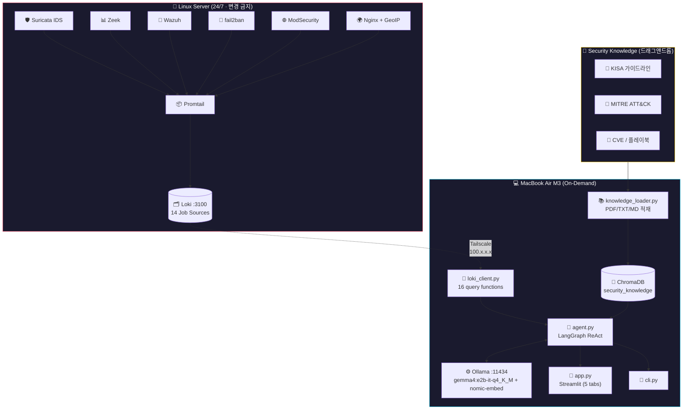
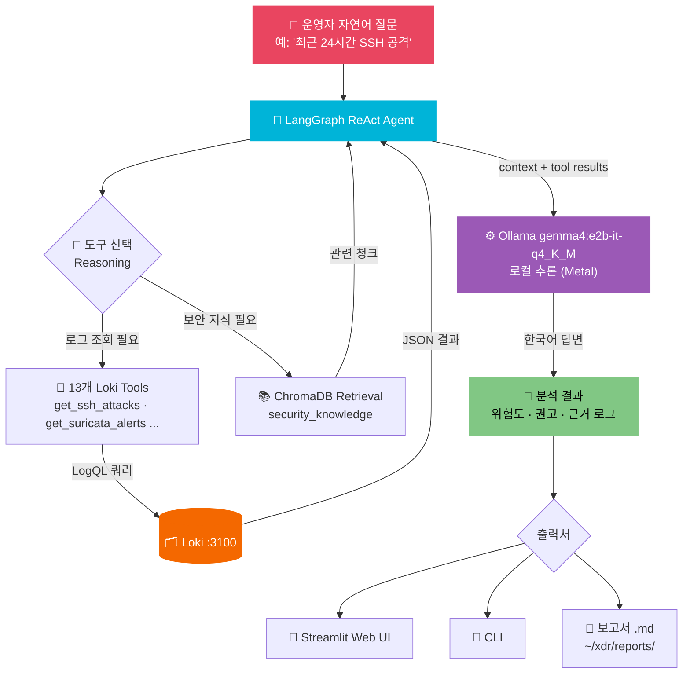
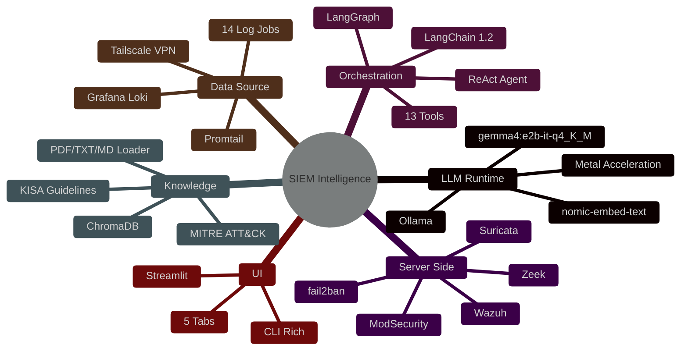
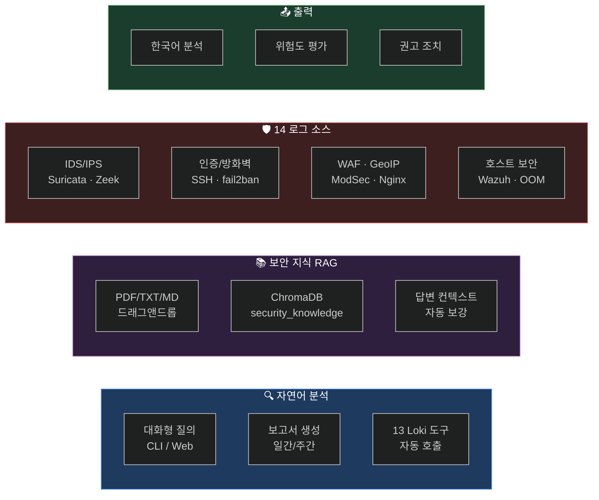
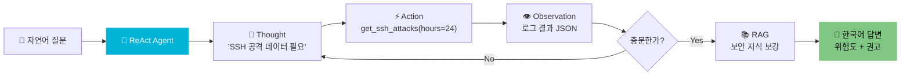
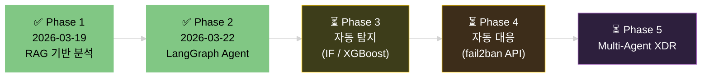

> 📦 이 폴더는 **[SIEM-Trinity](../README.md)** 모노레포의 **03-intelligence** 레이어입니다. 통합 아키텍처는 루트 README를, 다른 레이어는 [`01-collection/`](../01-collection/) · [`02-detection/`](../02-detection/) 참조.
>
> ⚠️ **2026-05 정책 변경:** 본래 맥북 on-demand 설계였으나 **서버 Docker 컨테이너로 전환**되었습니다 (`intelligence-ui` + `intelligence-ollama`). 본 README의 맥북·Metal·On-Demand 표현은 **역사 맥락**으로 남겨두며, 실제 배포는 루트 [`./start.sh`](../start.sh) 또는 [`docker-compose.yml`](docker-compose.yml) 참조.

<div align="center">

<!-- Hero Banner -->


<br/>

# SIEM Intelligence Layer

### 리눅스 SIEM 로그를 맥북에서 자연어로 분석하는 On-Demand AI 도구

**LangGraph ReAct Agent가 Loki를 직접 쿼리하고**
**KISA · MITRE 보안 지식 RAG로 컨텍스트를 보강합니다**

<br/>

<!-- Core Value Propositions -->
`🔍 Loki 14 Job 자연어 분석` &nbsp;
`🧠 보안 지식(KISA/MITRE) RAG 보강` &nbsp;
`💻 M3 로컬 추론 · 외부 API 의존 0`

<br/>

<!-- Tech Badges -->
[](https://python.org)
[](https://ollama.com)
[](https://langchain.com)
[](https://langchain-ai.github.io/langgraph)
[](https://trychroma.com)
[](https://streamlit.io)
[](https://grafana.com/oss/loki/)

<br/>

<!-- Status Badges -->


</div>

---

> [!NOTE]
> **SIEM Intelligence Layer**는 XDR/EDR이 아닙니다.
> 자동 탐지·자동 대응 없이, **사람이 켤 때만 작동하는** SIEM 로그 분석 보조 도구입니다.
> 외부 클라우드·외부 API 호출 없이 맥북 로컬에서 LLM 추론이 끝납니다.

> [!IMPORTANT]
> **서버 불변 원칙**: 리눅스 서버의 파일·서비스·설정을 절대 수정하지 않습니다.
> Loki HTTP API **읽기 호출만** 허용. scp/rsync로 로그 파일을 복사하지도 않습니다.

---

## 📑 목차

<table>
<tr>
<td width="50%">

- [🤔 XDR/EDR과의 차이](#-xdredr과의-차이)
- [🏗️ 아키텍처](#️-아키텍처)
- [🔄 데이터 흐름](#-데이터-흐름)
- [🛠 기술 스택](#-기술-스택)
- [📁 파일 구조](#-파일-구조)
- [✨ 핵심 기능](#-핵심-기능)

</td>
<td width="50%">

- [🤖 LangGraph Agent](#-langgraph-agent)
- [🖥️ Streamlit UI](#️-streamlit-ui)
- [🚀 빠른 시작](#-빠른-시작)
- [🔧 환경변수](#-환경변수)
- [💻 운영 & 개발](#-운영--개발)
- [🛣️ 로드맵](#️-로드맵)

</td>
</tr>
</table>

---

## 🤔 XDR/EDR과의 차이

| 구분 | 정의 | 이 프로젝트 |
|:----:|------|:-----------:|
| **XDR** | 자동 탐지 + 자동 대응 + 24/7 상시 가동 | ❌ on-demand, 사람이 켜야 작동 |
| **EDR** | 호스트 에이전트 기반 엔드포인트 모니터링 | ❌ Loki 로그 조회만, 에이전트 없음 |
| **SIEM Intelligence Layer** | 기존 SIEM 로그를 LLM + 보안 지식으로 분석 | ✅ **이것** |

---

## 🏗️ 아키텍처



### 설계 원칙

| 원칙 | 구현 |
|:----:|------|
| 🔒 **서버 불변** | 서버의 어떤 파일·서비스도 수정 금지. Loki HTTP API 읽기 호출만 허용 |
| ⏯️ **On-Demand** | 24/7 상시 동작 아님. 분석이 필요할 때만 맥북에서 `start.sh` 실행 |
| 🚫 **API 전용** | 로그 파일 직접 복사(scp/rsync) 금지. 모든 데이터는 Loki API 경유 |
| 💾 **로컬 벡터 저장** | `~/.xdr/chroma_db/` — 보안 지식·로그 임베딩은 맥북에만 존재 |
| 🇰🇷 **한국어 출력** | 모든 분석 결과·보고서는 한국어로 생성 |
| ⚡ **Metal 가속 필수** | Ollama 네이티브 설치(Docker 금지) — Apple GPU 가속 활용 |
| 🌐 **외부 API 의존 0** | OpenAI/Claude API 호출 없음. 맥북 로컬 LLM 추론으로 완결 |

---

## 🔄 데이터 흐름



---

## 🛠 기술 스택



### 의존성 관계

```
LangGraph  →  LangChain  →  Ollama (:11434)
                              ├── gemma4:e2b-it-q4_K_M      (LLM 추론)
                              └── nomic-embed-text (임베딩)
```

> **Ollama ≠ LangChain.** Ollama는 로컬 LLM 런타임(llama.cpp + Metal 가속), LangChain은 LLM 앱 오케스트레이션 프레임워크입니다. Ollama가 죽으면 전체 중단됩니다.

<details>
<summary><b>📋 상세 기술 스택 테이블</b></summary>

| Layer | 기술 | 버전 | 용도 |
|:-----:|------|:----:|------|
| **LLM Runtime** | Ollama | latest | 로컬 LLM 추론 서버 (llama.cpp + Metal) |
| | gemma4:e2b-it-q4_K_M | 5GB | 메인 추론 모델 |
| | nomic-embed-text | 300MB | 임베딩 생성 |
| **Agent** | LangChain | 1.2 | LLM 앱 프레임워크 |
| | langchain-ollama | latest | Ollama 바인딩 |
| | LangGraph | latest | ReAct Agent 그래프 |
| **Vector Store** | ChromaDB | latest | 로컬 파일 벡터 DB |
| | pypdf | latest | PDF 파싱 |
| **Data Source** | Grafana Loki | 3.0 | 서버 측 로그 집계 |
| | Tailscale | latest | VPN (서버 ↔ 맥북) |
| **UI** | Streamlit | latest | 웹 UI (`localhost:8501`) |
| | Rich | latest | CLI 컬러 출력 |
| **Hardware** | Apple M3 | 8-core | LPDDR5 16GB 통합 메모리 |

</details>

### 환경 사양

<table>
<tr>
<td width="50%">

#### 💻 MacBook Air M3 (분석)
| 항목 | 사양 |
|------|------|
| Chip | Apple M3 (4P + 4E) |
| GPU | 10 cores · Metal 4 |
| RAM | 16GB LPDDR5 통합 |
| Storage | 460GB (216GB free) |

</td>
<td width="50%">

#### 🐧 Linux Server (SIEM)
| 항목 | 사양 |
|------|------|
| OS | Ubuntu Server |
| CPU | Ryzen 5 5500GT (6C12T) |
| RAM | 16GB · NVMe 256GB |
| 접근 | Tailscale `100.x.x.x` |

</td>
</tr>
</table>

---

## 📁 파일 구조

```
SIEM-Trinity/03-intelligence/        # 프로젝트 루트 (배포는 Docker, 호스트 venv 는 디버그용)
├── 🔌 loki_client.py               # Loki API 쿼리 (16개 함수)
├── 🤖 agent.py                     # LangGraph ReAct Agent (13개 도구) ✨
├── 📚 knowledge_loader.py          # PDF/TXT/MD → ChromaDB security_knowledge ✨
├── 🧬 embedder.py                  # (Phase 1 레거시, 사용 안 함)
├── 🔗 rag_chain.py                 # LangChain RAG 체인
├── 📄 report.py                    # 일간/주간 보고서 생성
├── 💬 cli.py                       # CLI 대화 인터페이스
├── 🎨 app.py                       # Streamlit Web UI (5 탭)
├── 🚀 start.sh                     # 통합 메뉴 진입점 (레거시 — 운영은 루트 xdr-up.sh)
├── ⚙️  .env / .env.example         # 환경 변수
├── 📖 CLAUDE.md                    # Claude Code 개발 지시서
├── 📂 scripts/
│   ├── 🧠 build_attack_knowledge.py  # MITRE ATT&CK STIX → ChromaDB (697 techniques)
│   └── 💬 thehive_llm_comment.py     # XDR 단계 6: TheHive case → LLM 자연어 분석 코멘트
└── 📂 reports/                     # 생성 보고서 (.gitignore)

~/.xdr/                             # 로컬 데이터 저장소
├── 🧠 chroma_db/
│   ├── security_logs               # Phase 1 — 로그 스냅샷 (레거시)
│   └── security_knowledge          # Phase 2 — KISA/MITRE/플레이북 ✨
└── 🐍 venv/                        # Python 가상환경
```

---

## ✨ 핵심 기능



<details>
<summary><b>📋 수집 중인 14개 Loki Job 전체 목록</b></summary>

| Job | 내용 | Agent 도구 |
|-----|------|-----------|
| `auth` | SSH 로그인 실패 | `get_ssh_attacks` |
| `fail2ban` | IP Ban/Unban 이벤트 | `get_fail2ban_bans` |
| `suricata` | IDS 전체 이벤트 (JSON) | `get_suricata_alerts` |
| `wazuh` | 보안 알림 (level 7~15) | `get_wazuh_alerts` |
| `kern` | KR-BLOCK 방화벽, OOM | `get_kr_blocks` |
| `zeek_dns` | DNS 쿼리/응답 | `get_zeek_dns` |
| `zeek_notice` | 보안 탐지 이벤트 | `get_zeek_notice` |
| `zeek_http` | HTTP 요청 패턴 | `get_zeek_http` |
| `zeek_ssl` | TLS 연결 정보 | `get_zeek_ssl` |
| `zeek_weird` | 프로토콜 위반 | *(직접 쿼리)* |
| `modsec` | ModSecurity WAF | `get_modsec_alerts` |
| `nginx_visitors_geo` | GeoIP 공격 분포 | `get_nginx_geo` |
| `ss_ports` | 열린 포트 현황 | `get_open_ports` |
| `nginx_access_enriched` | HTTP 접근 로그 | *(직접 쿼리)* |

</details>

---

## 🤖 LangGraph Agent

> Phase 2의 핵심. **ReAct(Reasoning + Acting)** 패턴으로 Agent가 스스로 도구를 선택하고 호출합니다.



| 기능 | 설명 |
|------|------|
| 🔧 **13개 Loki 도구** | LogQL 직접 작성 없이 Agent가 의도에 맞는 도구 자동 선택 |
| 🔁 **반복 추론** | 한 번에 답이 안 나오면 다른 도구를 추가 호출 (최대 N회) |
| 📚 **지식 RAG** | KISA/MITRE 문서 청크를 답변 컨텍스트에 결합 |
| 🇰🇷 **한국어 강제** | 시스템 프롬프트로 모든 응답을 한국어로 고정 |

---

## 🖥️ Streamlit UI

### Streamlit을 쓰는 이유

이 프로젝트는 **혼자 쓰는 on-demand 분석 도구**입니다. 공개 서비스나 팀 대시보드가 아니므로 React + 백엔드 분리는 과잉입니다.

```python
# 이게 전부
import streamlit as st
question = st.chat_input("질문하세요")
if question:
    st.write(agent.run(question))
```

| 항목 | React + FastAPI | Streamlit |
|:----:|:---------------:|:---------:|
| 구현 규모 | 프론트 + 백엔드 분리 | Python 단일 파일 |
| 추가 기술 | JS, REST 설계 | 없음 |
| 파일 업로드 | `multer` 등 별도 처리 | `st.file_uploader()` |
| 채팅 UI | 상태관리 + WebSocket | `st.chat_message()` |

### 5개 탭 구성

| 탭 | 설명 |
|----|------|
| 💬 RAG 분석 | ChromaDB 기반 기존 분석 (Phase 1) |
| 🤖 **Agent 분석** | Loki 직접 쿼리 + 보안 지식 결합 **(권장)** |
| 📊 현황 | 실시간 보안 메트릭 |
| 📄 보고서 | 일간/주간 보고서 생성·다운로드 |
| 📚 지식 문서 | PDF/TXT/MD 드래그앤드롭 업로드 |

### React 전환이 의미 있어지는 시점

- 다중 사용자 동시 접속
- WebSocket 실시간 차트
- GeoIP 공격 지도 같은 인터랙티브 시각화
- 모바일 대응

---

## 🚀 빠른 시작

> [!IMPORTANT]
> **사전 요구사항**: macOS · Tailscale 연결 · Homebrew · Python 3.11+

### 1. Tailscale 연결 확인

```bash
curl http://100.x.x.x:3100/ready
# "ready" 응답이면 정상
```

### 2. Ollama 설치

```bash
brew install ollama
ollama pull gemma4:e2b-it-q4_K_M        # 메인 LLM (~5GB)
ollama pull nomic-embed-text   # 임베딩 모델 (~300MB)
```

### 3. Python 환경

```bash
python3 -m venv ~/.xdr/venv
source ~/.xdr/venv/bin/activate

pip install \
  langchain langchain-community langchain-ollama langgraph \
  chromadb requests rich streamlit python-dotenv pypdf
```

### 4. 환경 변수

```bash
cp .env.example .env
```

### 5. 실행

```bash
cd ~/xdr && ./start.sh
```

`start.sh`는 자동으로: ① Python venv 활성화 → ② Ollama 백그라운드 기동 → ③ Loki 연결 확인 → ④ 메뉴 출력

```
┌──────────────────────────────────────┐
│  SIEM Intelligence Layer — 보안 분석  │
├──────────────────────────────────────┤
│  1) 로그 동기화 (레거시, Loki→Chroma) │
│  2) 일간 보고서 생성                  │
│  3) 주간 보고서 생성                  │
│  4) CLI 대화형 분석 (RAG)             │
│  5) Web UI (Streamlit)               │
│  6) 컬렉션 상태 확인                  │
│  7) 지식 문서 추가 (파일 경로 입력)    │
│  0) 종료                              │
└──────────────────────────────────────┘
```

### 종료

| 상황 | 종료 방법 |
|------|----------|
| 메뉴 화면 | `0` 입력 |
| Web UI 실행 중 | 터미널에서 `Ctrl + C` |
| CLI 대화 중 | `exit` 또는 `Ctrl + C` |
| Ollama 완전 종료 | `pkill ollama` 또는 `brew services stop ollama` |

> [!TIP]
> Web UI 접속: `http://localhost:8501` (메뉴 5번 실행 후)

---

## 🔧 환경변수

<details>
<summary><b>⚙️ .env 전체 항목</b></summary>

| 변수 | 설명 | 예시 |
|------|------|------|
| `TAILSCALE_IP` | 서버 Tailscale IP | `100.x.x.x` |
| `LOKI_URL` | Loki 엔드포인트 | `http://100.x.x.x:3100` |
| `OLLAMA_URL` | 로컬 Ollama URL | `http://localhost:11434` |
| `OLLAMA_MODEL` | 사용할 LLM 모델명 | `gemma4:e2b-it-q4_K_M` |
| `EMBED_MODEL` | 임베딩 모델명 | `nomic-embed-text` |
| `CHROMA_PATH` | 벡터 DB 경로 | `/Users/{USER}/.xdr/chroma_db` |
| `REPORTS_PATH` | 보고서 출력 경로 | `/Users/{USER}/xdr/reports` |

</details>

<details>
<summary><b>🤖 선택 가능한 LLM 모델 (M3 16GB 기준)</b></summary>

| 모델 | 크기 | 속도 | 한국어 | 추천 용도 |
|------|:---:|:----:|:------:|----------|
| `gemma4:e2b-it-q4_K_M` | 5GB | ★★★★ | ★★★ | **기본값** |
| `mistral:7b` | 4.5GB | ★★★★★ | ★★★ | 빠른 응답 |
| `qwen2.5:14b` | 9GB | ★★★ | ★★★★★ | 한국어 품질 최우선 |
| `gemma2:9b` | 5.5GB | ★★★★ | ★★★ | 균형 |
| `deepseek-r1:8b` | 5GB | ★★★ | ★★★ | 복잡한 추론 |

> `.env`의 `OLLAMA_MODEL` 값만 바꾸면 전환됩니다.

</details>

---

## 💻 운영 & 개발

### CLI 개별 실행

```bash
python agent.py "최근 24시간 보안 위협 요약해줘"   # Agent 직접
python report.py                                    # 보고서 생성
python loki_client.py                               # Loki 연결 테스트
python knowledge_loader.py /path/to/kisa_guide.pdf "KISA_APT가이드"
python knowledge_loader.py                          # 등록 문서 목록
```

### 팀 내 공유 (배포 대신)

같은 VPN/Wi-Fi 안의 팀원과 공유:

```bash
streamlit run app.py --server.address 0.0.0.0 --server.port 8501
```

`http://맥북IP:8501` 접속. **맥북 + Ollama가 켜져 있어야** 합니다.

### 왜 외부 배포가 안 되는가

```
Streamlit (app.py)
    ↓ Python 함수 직접 호출
agent.py / rag_chain.py
    ↓ HTTP localhost:11434
Ollama  ← 맥북 로컬에만 존재

→ 배포 서버에는 Ollama가 없다 → LLM 추론 불가 → 전체 중단
```

<details>
<summary><b>🚢 배포하려면 변경해야 할 것</b></summary>

| 구성 요소 | 현재 | 배포 시 변경 |
|----------|------|-------------|
| LLM | Ollama (로컬) | GPU 서버 Ollama 또는 외부 API |
| 백엔드 | Streamlit이 Python 직접 호출 | FastAPI 서버 분리 |
| 벡터 DB | 로컬 파일 (`~/.xdr/chroma_db`) | ChromaDB Server / Qdrant |
| 인증 | 없음 | 로그인 + Loki URL 보호 |
| Loki | Tailscale VPN 경유 | 배포 서버도 VPN 진입 필요 |

</details>

---

## 🛣️ 로드맵

### Phase 진행 현황



> Phase 3 이상은 **on-demand 원칙을 포기**해야 진행 가능 (24/7 상시 가동 필요)

<details>
<summary><b>✅ Phase 1 완료 기준 (2026-03-19)</b></summary>

- [x] `curl http://100.x.x.x:3100/ready` → `ready`
- [x] `ollama list` → `gemma4:e2b-it-q4_K_M`, `nomic-embed-text` 존재
- [x] `python loki_client.py` → SSH 공격 건수 출력
- [x] `python embedder.py` → ChromaDB에 1,963 청크 저장
- [x] `python cli.py` → 자연어 질의에 한국어 답변
- [x] `python report.py` → `~/xdr/reports/` 에 `.md` 생성
- [x] `./start.sh` → 메뉴 1~6번 동작

</details>

<details>
<summary><b>✅ Phase 2 완료 기준 (2026-03-22)</b></summary>

- [x] `loki_client.py` 신규 소스 추가 (modsec, geo, zeek_http/ssl/weird, ss_ports)
- [x] `knowledge_loader.py` → ChromaDB security_knowledge 적재
- [x] `agent.py` → Loki 직접 쿼리 + 답변 (13개 도구)
- [x] Streamlit `📚 지식 문서` 탭 (드래그앤드롭)
- [x] Streamlit `🤖 Agent 분석` 탭 (위험도·권고 포함)

</details>

<details>
<summary><b>⏳ Phase 3~5 — 진짜 XDR로 가는 길</b></summary>

| 단계 | 추가되는 것 | 핵심 |
|:----:|------------|------|
| **3** | 탐지 (Detection) | 정형 로그 피처 추출 → Isolation Forest / XGBoost → 임계값 초과 자동 알림 |
| **4** | 대응 (Response) | fail2ban API 연동 → 공격 IP 자동 차단, Slack/이메일 알림 |
| **5** | Multi-Agent XDR | 탐지 에이전트 + 분석 에이전트 + 대응 에이전트 협력 |

| 항목 | 현재 (Phase 2) | 진짜 XDR |
|------|:--------------:|:--------:|
| 탐지 | ❌ 사람이 질문해야 | ✅ 자동 실시간 |
| 분석 | ✅ LLM + 보안지식 | ✅ LLM + ML 결합 |
| 대응 | ❌ 없음 | ✅ 자동 차단/알림 |
| 24/7 | ❌ on-demand | ✅ 상시 가동 |

</details>

---

## 📚 학습 문서

> 프로젝트를 진행하며 정리한 개념 문서. `docs/` 디렉터리.

<details>
<summary><b>🤖 LLM / Agent / RAG</b></summary>

| 문서 | 내용 |
|------|------|
| [Agent 개념과 도입](docs/01_LLM/프레임워크/Agent_개념과_도입.md) | Agent란 무엇인가, 블랙박스 문제 |
| [LLM 스택 Spring 비교](docs/01_LLM/프레임워크/LLM_스택_Spring_비교.md) | Ollama=JVM, LangChain=Spring 비유 |
| [LangChain 생태계](docs/01_LLM/프레임워크/LangChain_생태계.md) | LangChain 구성요소 전체 지도 |
| [RAG 고급 패턴](docs/01_LLM/방법론/RAG_고급패턴.md) | HyDE, Self-Query, Multi-Query |
| [진화 로드맵](docs/01_LLM/프로젝트/진화_로드맵.md) | 단계별 발전 방향 |
| [임베딩](docs/01_LLM/개념/임베딩.md) | 벡터 임베딩 개념 |
| [Context Window](docs/01_LLM/개념/Context_Window.md) | 컨텍스트 한계 |
| [Hallucination](docs/01_LLM/개념/Hallucination.md) | 환각 원인과 RAG 완화 |

</details>

<details>
<summary><b>🧠 딥러닝 / 하드웨어</b></summary>

| 문서 | 내용 |
|------|------|
| [Transformer](docs/02_딥러닝/02_아키텍처/Transformer.md) | Self-Attention, LLM의 근간 |
| [딥러닝에서 LLM으로](docs/02_딥러닝/03_LLM연결/딥러닝에서_LLM으로.md) | 신경망 → Transformer → LLM |

</details>

<details>
<summary><b>📊 전통 ML / AI 발전사 / 정보보안</b></summary>

| 문서 | 내용 |
|------|------|
| [AI 발전사 전체 순서도](docs/03_전통ML/01_기초/AI_발전사_전체순서도.md) | 1943~2026 타임라인 |
| [전통 ML vs LLM 파인튜닝](docs/03_전통ML/02_방법론/전통ML_vs_LLM파인튜닝.md) | 언제 어떤 접근 |
| [ML 보안 적용 사례](docs/03_전통ML/03_생태계/ML_보안적용사례.md) | IDS, 이상 탐지 |
| [정보보안 시스템 전체 구조](docs/05_정보보안/01_개념/정보보안_시스템_전체구조.md) | SIEM/XDR/EDR/SOC |

</details>

---

<div align="center">

**SIEM Intelligence Layer** · 개인 학습 + 실전 보안 분석 도구
Built with **Python · Ollama · LangGraph · ChromaDB · Streamlit**


</div>
