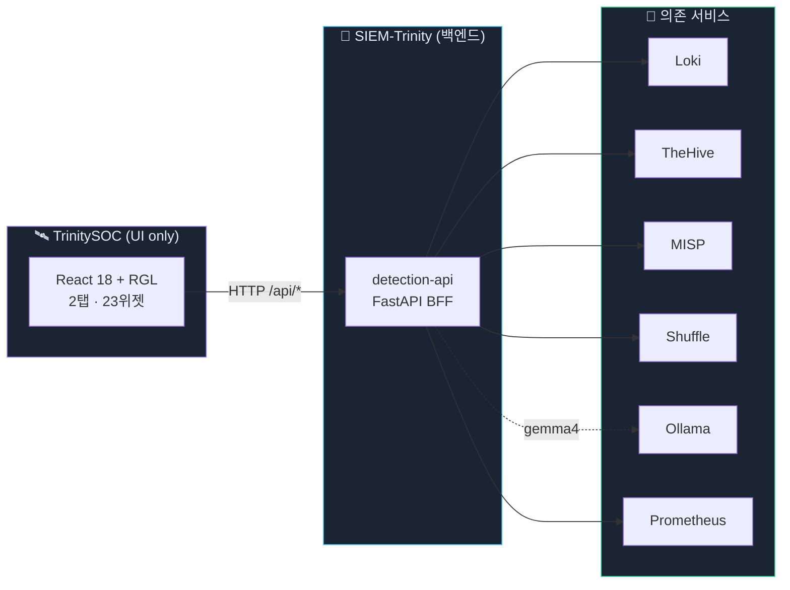
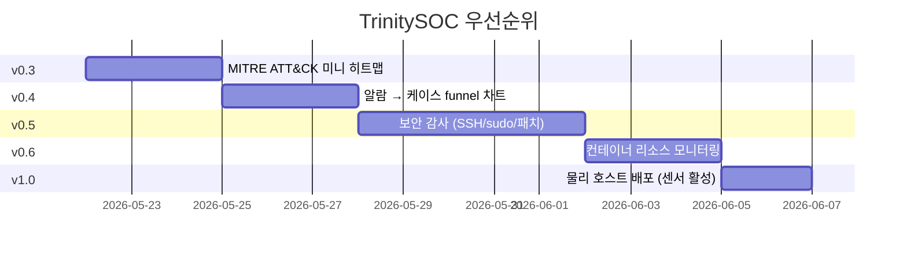

<div align="center">

# 🛰️ TrinitySOC

### **SIEM-Trinity 의 통합 운영자 콘솔 (Unified SOC Console)**

흩어진 6개 보안 UI 를 하나의 다크 테마 콘솔로 + 드래그·CRUD 가능한 위젯 대시보드

<br>

[]
[](docs/WIDGETS.md)
[](https://react.dev)
[](https://www.typescriptlang.org)
[](https://vitejs.dev)
[](https://tailwindcss.com)
[](https://echarts.apache.org)
[](https://github.com/react-grid-layout/react-grid-layout)

[**🏠 SIEM-Trinity 본체**](https://github.com/adorahelen/siem-trinity-public) · [**🏗 아키텍처**](docs/ARCHITECTURE.md) · [**🧩 위젯 카탈로그**](docs/WIDGETS.md) · [**🎨 디자인 토큰**](docs/design-tokens.md) · [**🗺 페이지 맵**](docs/page-map.md)

</div>

---

## ✨ 한 줄로

> **"수집(Grafana) · 탐지(detection-api) · 분석(LLM) · 대응(TheHive·MISP·Shuffle) — 6개 흩어진 UI 를 1개 콘솔에 흡수 + 위젯을 사용자가 직접 배치"**

스마트폰 위젯처럼 드래그·리사이즈·추가·편집·삭제 가능. 보안과 인프라가 **2탭으로 분리**되어 각자 정체성 명확.

---

## 🧭 Observability 3축 매핑

| 축 | 도구 | TrinitySOC 안에서 |
|---|---|---|
| 🛡 **Security Observability** | SIEM + EDR + SOAR + XDR | **본업 — 보안 탭 14위젯** |
| 🖥 **Infrastructure Observability** | Prometheus + node-exporter | **인프라 탭 9위젯** |
| 🧪 **Application Observability (APM)** | Grafana 자체 | 외부 위임 |

자세히 → [docs/ARCHITECTURE.md](docs/ARCHITECTURE.md)

---

## 🏗️ 아키텍처



**핵심 원칙**: TrinitySOC 는 TheHive/MISP/Loki/Prometheus 를 **직접 호출하지 않는다**. SIEM-Trinity 의 `detection-api` 가 단일 BFF 진입점.

---

## 🧩 위젯 시스템

14개 위젯 종류, 드래그·리사이즈·CRUD·localStorage 영속화.

| 카테고리 | 종류 | 비고 |
|---|---|---|
| **데이터 카드** | `metric` · `gauge` · `resource` · `thehive_kpi` · `uptime` · `xdr_toggles` | 단일 값·% 카드 |
| **시계열·차트** | `timeseries` · `topk` | ECharts |
| **로그·스트림** | `log` | LogQL 실시간 표시 |
| **시스템 정보** | `network` · `storage` · `ports` · `sensors` | 호스트 메타 |

전체 명세 → [docs/WIDGETS.md](docs/WIDGETS.md)

---

## 📑 페이지 맵

| # | 라우트 | 역할 | 동작 |
|:---:|---|---|---|
| 1 | [`/`](#) | **Overview** · 보안 ⊕ 인프라 2탭 | 드래그·CRUD·영속화 |
| 2 | [`/alerts`](#) | **알람** · 페이지네이션 · 상세 모달 · 3 액션 버튼 | TheHive 케이스 생성·MISP 조회·IP 차단 |
| 3 | [`/detector`](#) | **AI 탐지** · 4 탐지기 (IP·흐름·비콘·DGA) | 즉시실행 버튼 |
| 4 | [`/attack`](#) | **MITRE ATT&CK** · Top 기술 · Navigator JSON | |
| 5 | [`/analyzer`](#) | **AI 분석** · 알람 선택 → LLM 4섹션 분석 | gemma4 + RAG |
| 6 | [`/llm`](#) | **LLM 채팅** · 자유 대화 | gemma4 |
| 7 | [`/logs`](#) | **로그** · LogQL 프리셋 8종 + 사용자 입력 | |
| 8 | [`/cases`](#) | **케이스** · TheHive 사고 추적 | |
| 9 | [`/intel`](#) | **위협 인텔** · IP/도메인 IOC 검색 | MISP |
| 10 | [`/workflows`](#) | **SOAR 워크플로** | 🔗 Shuffle |
| 11 | [`/actions`](#) | **능동대응** · auto-ban 이력 | |
| 12 | [`/settings`](#) | **설정** · XDR 토글·스케줄러 상태 | |

자세히 → [docs/page-map.md](docs/page-map.md)

---

## 🎨 디자인 시스템

<details>
<summary><b>색상 토큰 (다크 우선)</b></summary>

| 토큰 | hex | 용도 |
|---|---|---|
| `bg-base` | `#0b0f17` | 페이지 배경 |
| `bg-surface` | `#131a26` | 카드/패널 |
| `bg-elevated` | `#1b2433` | 모달/드롭다운 |
| `accent-brand` | `#a78bfa` | 브랜드 강조 |
| `accent-info` | `#38bdf8` | 정보·링크 |
| `accent-ok` | `#34d399` | 정상·성공 |
| `accent-warn` | `#fbbf24` | 경고 |
| `accent-crit` | `#f87171` | 위험·차단 |

</details>

<details>
<summary><b>심각도 5단계</b></summary>

| Level | Label | Color | 적용 |
|:---:|---|---|---|
| 0 | Info | `#38bdf8` | 정보성 |
| 1 | Low | `#60a5fa` | 낮은 위험 |
| 2 | Medium | `#fbbf24` | 보통 |
| 3 | High | `#fb923c` | 높음 |
| 4 | Critical | `#f87171` | 즉시 대응 |

</details>

전체 토큰 → [docs/design-tokens.md](docs/design-tokens.md)

---

## 🚀 사용

### 232 서버에 이미 가동 중

```
http://<서버IP>:5173
```

### 로컬 개발

```bash
# 04-ui 는 이 저장소에 subtree 로 통합돼 있다 (별도 리포는 아카이브됨)
git clone https://github.com/adorahelen/siem-trinity-public.git
cd TrinitySOC
npm install
npm run dev            # http://localhost:5173 (vite proxy → 192.168.10.232:2027)
```

### 프로덕션 빌드 + nginx 배포

```bash
npm run build
cd deploy
docker compose up -d   # nginx:1.27-alpine on :5173
                       # 02-detection_siem-internal + 03-intelligence_intelligence-internal 네트워크 사용
```

자세한 BFF 의존성·네트워크 → [docs/page-map.md](docs/page-map.md)

---

## 🧩 위젯 CRUD 사용법

1. 우상단 **🔒 고정됨** 클릭 → **🔓 편집 중** 전환
2. 위젯 마우스 호버 → 상단 **드래그 핸들** + **✏ 편집** + **🗑 삭제** 표시
3. **+ 위젯 추가** → 14종 중 선택 → config 입력 → 저장
4. **↺ 기본값** → 해당 탭만 초기 레이아웃 복원
5. 모든 변경은 **localStorage** 즉시 저장 (탭별 독립 키)

---

## 🧱 기술 스택

| 영역 | 선택 | 이유 |
|---|---|---|
| 빌드 | Vite 5 | 빠른 HMR |
| 언어 | TypeScript strict | `any` 금지 |
| 프레임워크 | React 18 | function component only |
| 라우팅 | React Router v6 | `lazy()` 코드 스플릿 |
| 서버 상태 | TanStack Query | 캐시·재시도·refetch |
| UI 상태 | Zustand | 전역 토글 최소화 |
| 스타일 | TailwindCSS + CSS vars | 토큰 기반 일관성 |
| **차트** | **ECharts** (echarts-for-react) | Recharts/Chart.js 금지 — 일관성 |
| **그리드** | **react-grid-layout** (legacy import) | 드래그/리사이즈 + 영속화 |
| 아이콘 | lucide-react | — |

---

## 📊 v0.2 상태 (현재 — 탭 분리 완성)

<div align="center">

| ✅ 완료 | ⏭ 다음 단계 |
|:---:|:---:|
| 보안/인프라 2탭 분리 | 보안 감사 (SSH/sudo) |
| 23개 기본 위젯 | MITRE 히트맵·funnel |
| 드래그·리사이즈·CRUD | MTTD/MTTR 측정 |
| BFF 12개 엔드포인트 | Shuffle 워크플로 임베드 |
| 알람→케이스/차단/IOC 3액션 | 컨테이너 리소스 모니터링 |

</div>

---

## 🛣️ 로드맵



---

## 📂 디렉토리

```
TrinitySOC/
├── src/
│   ├── pages/                 # 12개 라우트 페이지
│   ├── components/
│   │   ├── DashboardGrid.tsx  # react-grid-layout 래퍼
│   │   ├── WidgetRenderer.tsx # 14종 위젯 switch
│   │   ├── WidgetEditor.tsx   # 추가·편집 모달
│   │   └── *Card.tsx          # 14종 위젯 컴포넌트
│   ├── lib/
│   │   ├── widgets.ts         # 위젯 카탈로그 + 기본 레이아웃 (보안/인프라)
│   │   ├── api.ts             # BFF 클라이언트
│   │   ├── format.ts          # 포맷터
│   │   └── uid.ts             # nanoid
│   └── styles/tokens.css      # 디자인 토큰
├── deploy/
│   ├── nginx.conf             # /api 프록시 + iframe 임베드 프록시
│   └── docker-compose.yml     # nginx:1.27-alpine
├── docs/
│   ├── ARCHITECTURE.md        # 3축 Observability + XDR 매핑
│   ├── WIDGETS.md             # 14종 위젯 카탈로그
│   ├── page-map.md            # 라우트·BFF 명세
│   └── design-tokens.md
├── CLAUDE.md                  # 작업 규율
└── README.md
```

---

## 🔄 체크포인트 (롤백용 git tag)

| tag | 의미 |
|---|---|
| `checkpoint/pre-tabs` | 단일 dashboard 시절 (혼재) |
| `checkpoint/tabs-v1` | 2탭 분리 + 6위젯 추가 후 |
| `checkpoint/pre-readme` | README 재작성 직전 |

```bash
git checkout -b rollback checkpoint/tabs-v1   # 안전한 새 브랜치
```

---

## 🤝 관련 리포

- **[SIEM-Trinity](https://github.com/adorahelen/siem-trinity-public)** — 수집·탐지·분석·자동대응 백엔드 (이 리포의 데이터 출처)
- **TrinitySOC** — 통합 UI (이 리포)

---

<div align="center">

**Built with 🌑 dark mode in mind · Tab-by-tab observability**

</div>
