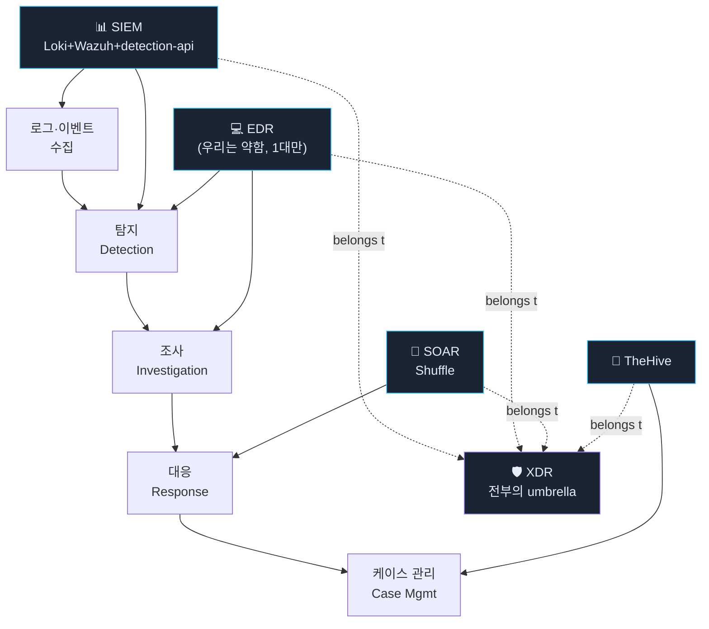
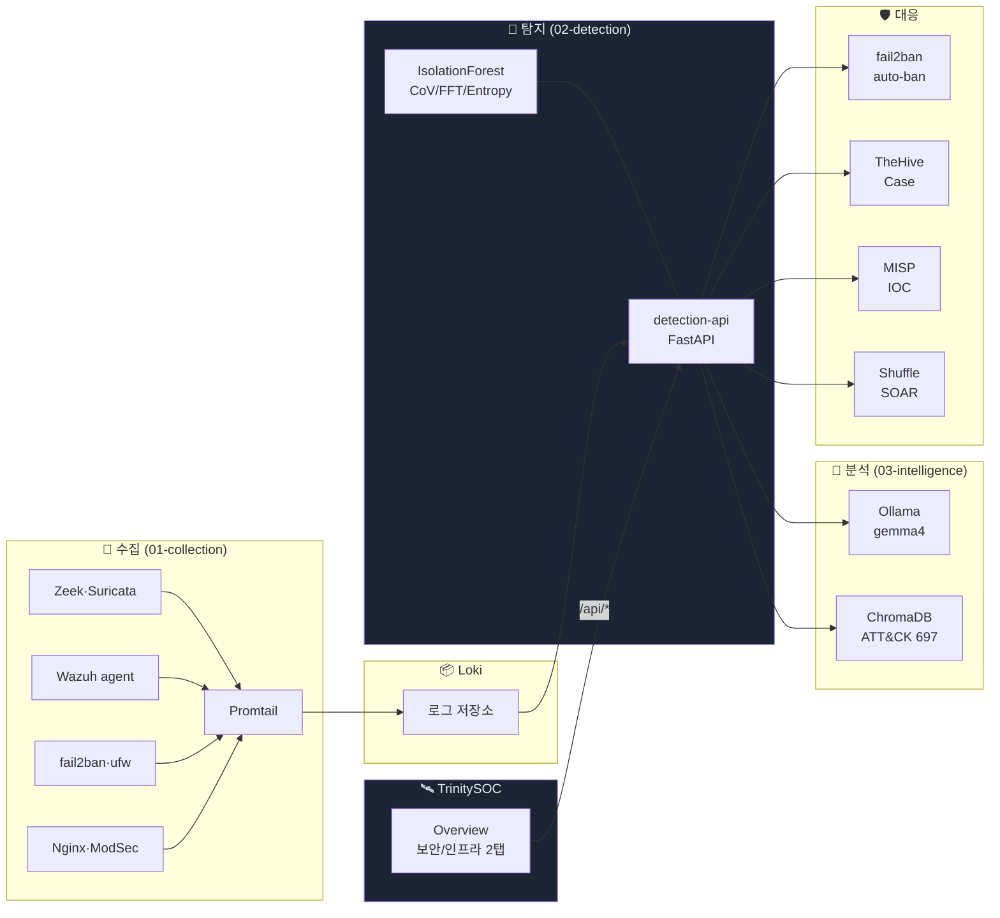

# TrinitySOC 아키텍처

> 3축 Observability 위에 XDR 정체성을 얹는다.

## 1. Observability 3축

업계 표준 분류:

| 도메인 | 영문 | 대표 도구 | 관측 대상 |
|---|---|---|---|
| 🖥 인프라 | Infrastructure Observability | Prometheus + node-exporter | CPU·메모리·디스크·네트워크·온도·전력 |
| 🧪 애플리케이션 | APM (Application Performance Monitoring) | Sentry·Datadog APM·OpenTelemetry | 응답시간·에러율·트랜잭션 |
| 🛡 보안 | Security Observability (SecOps) | SIEM + EDR + SOAR + XDR | 알람·공격·IoC·자동대응 |

**TrinitySOC 의 정체성**: 🛡 보안에 90%, 🖥 인프라에 10% 부속, 🧪 APM 은 Grafana 에 위임.

## 2. SIEM / SOAR / XDR / EDR 의 관계



| 개념 | 역할 | TrinitySOC 안에서 |
|---|---|---|
| **SIEM** | 로그 → 탐지 + 검색 | Loki + detection-api |
| **EDR** | 엔드포인트 깊은 추적 | Wazuh (약함, 호스트 1대만) |
| **SOAR** | 자동화 워크플로 | Shuffle |
| **XDR** | 위 셋 + 케이스 관리의 umbrella | **TrinitySOC 자체** |

→ **XDR = SIEM ⊕ EDR ⊕ SOAR + Case Mgmt**. "전부 하나로 본다" 가 XDR 의 정의.

## 3. 4계층 = 4기술 스택 (SIEM-Trinity 의 본질)

| 단계 | 기술 | 본질 | TrinitySOC 안에서 |
|---|---|---|---|
| 수집 | 일반 SW | 로그를 DB에 옮기고 그래프 | `/logs` |
| 탐지 | ML | IsolationForest · 통계 | `/alerts`, `/detector`, `/attack` |
| 분석 | LLM | gemma4 + RAG + ATT&CK 697 | `/analyzer`, `/llm` |
| 대응 | 규칙 자동화 | if-then. 결정론적 | `/cases`, `/intel`, `/workflows`, `/actions` |

뒤로 갈수록 *"틀리면 안 되는 정도"* 가 커진다 — 똑똑한 기술 → 멍청하지만 확실한 기술로 내려가는 구조.

## 4. 데이터 흐름 (전체)



## 5. TrinitySOC 의 위치

```
                  ┌──────────────────────────────────┐
                  │  사용자 (운영자)                  │
                  └────────────┬─────────────────────┘
                               │
                  ┌────────────▼─────────────────────┐
                  │  TrinitySOC                       │
                  │  • 2탭 (보안·인프라)              │
                  │  • 23 기본 위젯 + CRUD            │
                  │  • localStorage 영속화            │
                  └────────────┬─────────────────────┘
                               │ HTTP /api/*
                  ┌────────────▼─────────────────────┐
                  │  SIEM-Trinity / 02-detection BFF  │
                  │  (detection-api FastAPI)          │
                  │  • 25+ 엔드포인트                │
                  │  • 위협 인텔·로그·메트릭·LLM 통합 │
                  └─┬─────────┬─────────┬───────────┬┘
                    │         │         │           │
                ┌───▼───┐  ┌──▼──┐  ┌───▼───┐  ┌───▼───┐
                │ Loki  │  │ Prom │  │ Ollama│  │TheHive│
                │       │  │      │  │       │  │ MISP  │
                │       │  │      │  │       │  │Shuffle│
                └───────┘  └──────┘  └───────┘  └───────┘
```

## 6. 핵심 설계 원칙

### TrinitySOC
1. **UI only** — 비즈니스 로직 없음. 모든 데이터는 BFF 경유.
2. **단일 차트 라이브러리** — ECharts. Recharts/Chart.js 금지.
3. **단일 그리드 라이브러리** — react-grid-layout. 다른 방식 금지.
4. **위젯 = data + layout 분리** — 카탈로그형 구조. 새 위젯은 카탈로그에 추가만.
5. **tab 별 독립 localStorage** — 사용자가 무엇을 망쳐도 다른 탭은 안전.

### SIEM-Trinity 측 (BFF)
1. **silent fail** — 의존 도구 비활성 시 빈 응답 (탐지 파이프라인 안 막힘).
2. **단일 진입점** — 모든 외부 통신은 detection-api 경유.
3. **호스트 정보는 Prometheus 우선** — `/proc` 직접 파싱은 최후 수단.
4. **물리/VM 환경 호환** — 센서는 환경 감지 후 우아하게 fallback.

## 7. EDR 부족분 (의도적 한계)

| EDR 기능 | 우리 구현도 | 사유 |
|---|---|---|
| 다중 엔드포인트 에이전트 | ❌ | 홈서버 1대 |
| 프로세스 트리·부모자식 | ❌ | 시각화 미구현 |
| 메모리 분석 | ❌ | Volatility/eBPF 미통합 |
| 원격 프로세스 kill·격리 | ❌ | Wazuh Active Response 미설정 |
| 다중 OS (Win/macOS) | ❌ | Linux only |

→ 진짜 EDR 까지 가려면 약 1~2개월 추가. 현 단계는 **"엔드포인트 1대 + 풀 XDR 흐름"** 의 단단한 시연.

## 8. 미래 확장 축

| 축 | 작업 | 우선도 |
|---|---|---|
| MITRE ATT&CK 미니 히트맵 | Overview 보안 탭 추가 | ★★★ |
| 알람 → 케이스 funnel | 전환율 시각화 | ★★ |
| 보안 감사 위젯 | SSH/sudo/패치 설정 표시 | ★★ |
| MTTD·MTTR 측정 | 알람·케이스 timestamp 분석 | ★★ |
| 컨테이너 리소스 | cadvisor 통합 | ★ |
| 물리 호스트 배포 | 센서·전력 자동 활성 | ★ |
