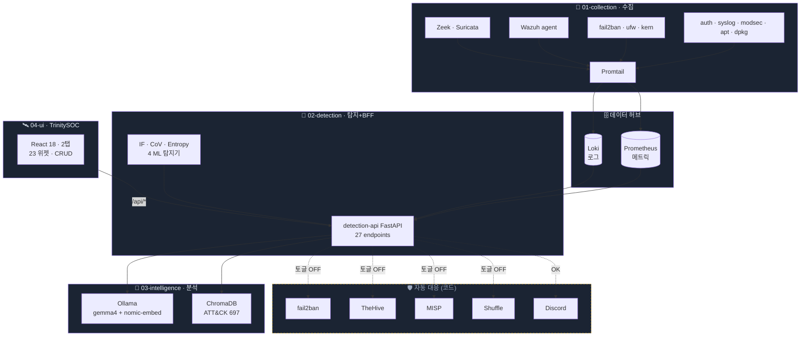
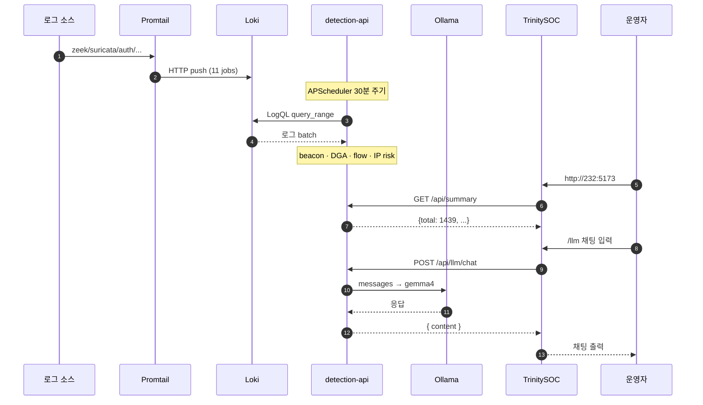
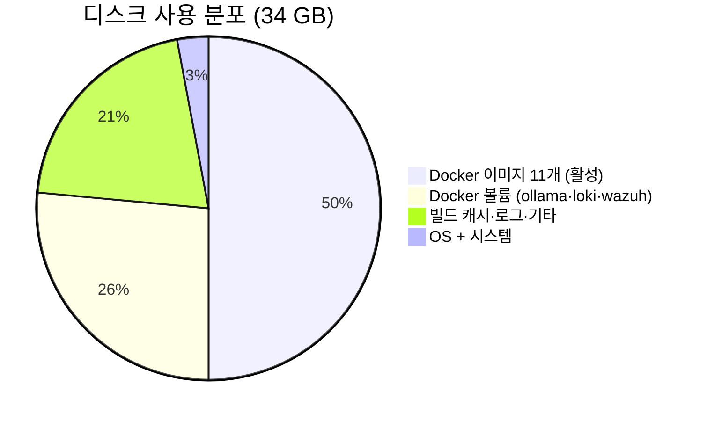
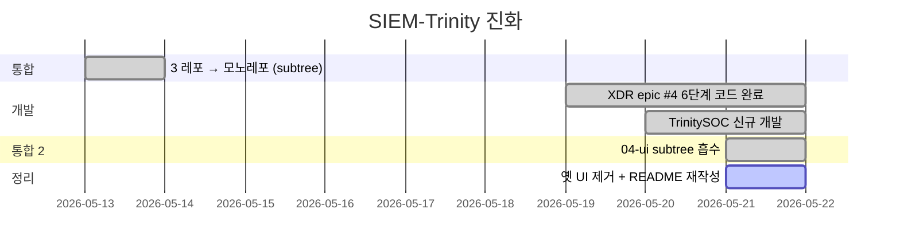

<div align="center">


# SIEM-Trinity

### **홈서버 1대로 굴리는 자작 XDR 모노레포**

`수집` · `탐지` · `분석` · `대응` + **통합 UI(TrinitySOC)** 4계층 단일 리포

<br/>

[](#-가동-중인-컨테이너-10개)
[](#-4계층-모노레포)
[](#-xdr-자동-대응-체인)
[](#-xdr-자동-대응-체인)
[](#-디렉토리-비중)

<br/>

[](https://kernel.org)
[](https://ubuntu.com)
[](https://docs.docker.com/compose)
[](https://grafana.com/oss/loki/)
[](https://prometheus.io)
[](https://wazuh.com)
[](https://python.org)
[](https://fastapi.tiangolo.com)
[](https://scikit-learn.org)
[](https://ollama.com)
[](https://react.dev)
[](https://www.typescriptlang.org)
[](https://echarts.apache.org)

<br/>

**[`🛰 TrinitySOC 콘솔`](04-ui/README.md)** ·
[`🏛 아키텍처`](#-아키텍처) ·
[`📦 4계층`](#-4계층-모노레포) ·
[`🚀 빠른 시작`](#-빠른-시작) ·
[`🛡 자동 대응`](#-xdr-자동-대응-체인) ·
[`📜 라이선스`](docs/credits.md)

</div>

---

> [!NOTE]
> **이 저장소는 공개판입니다.** 운영 저장소와 코드·문서는 동일하되, 실 운영 호스트를 특정할 수 있는 것만 덜어냈습니다.
>
> | 덜어낸 것 | 이유 |
> |---|---|
> | 옵저버빌리티 감사 보고서 · 백도어 점검 기록 | 호스트명·계정·공인 IP·SSH 키 소유자 등 자산 정보 |
> | 운영자 개인 사이트 nginx 서버블록 | 개인 도메인 설정 → [`nginx-site.conf.example`](01-collection/config/nginx-site.conf.example) 로 일반화해 대체 |
> | MITRE ATT&CK STIX 원본 (51 MB) | 용량. [`datasets/scripts/refresh-attack.sh`](datasets/scripts/refresh-attack.sh) 로 내려받습니다 |
>
> 문서에 남은 IP 중 `192.168.10.232`(RFC1918)·`203.0.113.x`(TEST-NET-3)·`100.x.x.x`(Tailscale CGNAT 자리표시자)는 **예시값**이고, `218.92.0.23` 같은 공인 IP 는 실제 로그에 잡힌 **공격 출발지**입니다.

> [!NOTE]
> **이 README 는 232 운영 호스트의 실측값을 기준**으로 작성됐습니다. 측정 시점: **2026-05-21**. 옛 버전은 [`docs/README-legacy-v3.md`](docs/README-legacy-v3.md).

> [!IMPORTANT]
> **단일 진실 출처(SSOT).** 레이어별 상세는 `01-04` 폴더의 README 를, UI 는 [`04-ui/README.md`](04-ui/README.md), 아키텍처는 [`docs/architecture.md`](docs/architecture.md).

> [!WARNING]
> **Linux x86_64 (Ubuntu/Debian) 전용.** macOS · Windows · ARM64 비지원 — fail2ban · UFW · systemd · node-exporter 가 Linux 의존.

---

<!-- DOCS-INDEX:START -->

## 📑 목차

<table>
<tr>
<td width="50%">

- [📄 문서](#-문서)
- [🎯 한 줄로](#-한-줄로)
- [🏛️ 아키텍처](#️-아키텍처)
- [🖥 운영 호스트 (232 실측)](#-운영-호스트-232-실측)
- [🐳 가동 중인 컨테이너 (10개)](#-가동-중인-컨테이너-10개)
- [📦 4계층 모노레포](#-4계층-모노레포)
- [📡 Loki labels (jobs)](#-loki-labels-jobs)
- [📊 탐지 통계 (실측 — 2026-05-21)](#-탐지-통계-실측--2026-05-21)
- [🛡 XDR 자동 대응 체인](#-xdr-자동-대응-체인)
- [🧠 LLM (현재 실측)](#-llm-현재-실측)

</td>
<td width="50%">

- [🛰 TrinitySOC (`04-ui/`)](#-trinitysoc-04-ui)
- [🚀 빠른 시작](#-빠른-시작)
- [🔄 데이터 흐름 (현재 운영)](#-데이터-흐름-현재-운영)
- [💾 디스크 사용 분포 (232 실측 34 GB)](#-디스크-사용-분포-232-실측-34-gb)
- [🖥 지원 / 비지원 환경](#-지원--비지원-환경)
- [📚 레이어별 README](#-레이어별-readme)
- [🗺 모노레포 운영](#-모노레포-운영)
- [🧪 사실 검증 가이드](#-사실-검증-가이드)
- [📖 개발 이력](#-개발-이력)
- [📄 문서](#-문서)

</td>
</tr>
</table>

---

## 📄 문서

이 저장소는 표준 5축 문서 구조를 따릅니다.

| 축 | 문서 |
|---|---|
| ① 요구사항 | [requirements.md](requirements.md) |
| ② 설계 | [architecture.md](architecture.md) |
| ③ 인터페이스 | [api-reference.md](api-reference.md) |
| ④ 보안 | [security-review.md](security-review.md) |
| ⑤ 검증 | [testing-guide.md](testing-guide.md) · [verification-log.md](verification-log.md) |
<!-- DOCS-INDEX:END -->


## 🎯 한 줄로

> **SIEM** (로그→탐지) **+ EDR** (엔드포인트) **+ SOAR** (자동대응) **+ Case Mgmt** (TheHive) **+ LLM 분석** (gemma4) **+ 자체 UI** (TrinitySOC) — 전부 한 머신, 한 리포.

---

## 🏛️ 아키텍처



> 점선·노란색 = **현재 토글 OFF (코드 ✅, 운영 ⏸)**.

---

## 🖥 운영 호스트 (232 실측)

| 항목 | 값 |
|---|---|
| **OS** | Ubuntu 24.04.2 LTS · kernel `6.8.0-111-generic` |
| **CPU** | AMD Ryzen 9 9950X3D · 8 cores (VM) |
| **RAM** | 15 GiB (사용 1.7 / 가용 13) |
| **디스크** | 61 GB · 사용 **34 GB (57%)** · 가용 26 GB |
| **호스트명 · 공인 IP** | *(비공개 — 실 운영 호스트)* |
| **내부 IP** | `192.168.10.232/24` (ens18) · RFC1918 |
| **외부 노출 포트** | `5173` (TrinitySOC) 단 1개 — 나머지 localhost 바인딩 |

---

## 🐳 가동 중인 컨테이너 (10개)

| 컨테이너 | 이미지 | 포트 | 역할 |
|---|---|---|---|
| 🛰 **trinitysoc** | `nginx:1.27-alpine` | **0.0.0.0:5173 → 80** | **메인 UI (외부 노출)** |
| 🎯 detection-api | `02-detection-detection-api` | 127.0.0.1:2027 → 8000 | FastAPI BFF · 4 ML 탐지기 |
| 🧠 intelligence-ollama | `ollama/ollama:latest` | 127.0.0.1:11434 | LLM 런타임 |
| 📦 loki | `grafana/loki:2.9.4` | 127.0.0.1:3100 | 로그 저장소 |
| 📡 promtail | `grafana/promtail:2.9.4` | — | 로그 수집기 |
| 📊 prometheus | `prom/prometheus:latest` | 127.0.0.1:9090 | 메트릭 저장소 |
| 🔬 node-exporter | `prom/node-exporter:latest` | 9100 (내부) | 호스트 메트릭 |
| 📈 grafana | `grafana/grafana:10.3.3` | 127.0.0.1:3000 | (선택) 백업 대시보드 |
| 🛡 wazuh-manager | `wazuh/wazuh-manager:4.14.3` | 127.0.0.1:1514-1515 | HIDS 매니저 |
| 🎭 siem-replay | `siem-replay:local` | — | 합성 로그 생성기 |

> [!TIP]
> **외부 노출이 5173 하나**라는 게 핵심. SOC 운영자도 외부 IP 도 그 한 입구만 본다.

---

## 📦 4계층 모노레포

```
siem-trinity-public/                (1.9 MB 코드)
├── 01-collection/      수집 인프라
├── 02-detection/       탐지 엔진 + FastAPI BFF
├── 03-intelligence/    LLM 모듈 + Ollama 런타임
├── 04-ui/              TrinitySOC (React 18 + 2탭)
└── docs/
```

### 디렉토리 비중

| 디렉토리 | LoC | 비중 | 언어 |
|---|---:|---:|---|
| 01-collection | 1,600 | 14% | Python · YAML · MD |
| 02-detection | 3,136 | 27% | Python (FastAPI) |
| 03-intelligence | 1,867 | 16% | Python (LangGraph) |
| **04-ui** | **4,815** | **43%** | TypeScript (React) |
| **합** | **11,418** | 100% | |

> 04-ui 는 2026-05-21 git subtree 로 `kangminlog/TrinitySOC` 리포에서 통합됨 (히스토리 보존).

---

## 📡 Loki labels (jobs)

**232 에서 실제 데이터 흘리는 11개** (2026-05-21 측정):
```
apt · auth · dpkg · fail2ban · kern · modsec · suricata · syslog · ufw · wazuh · zeek_conn
```

**`promtail-config.yml` 에 설정만 되고 입력 파일 부재 시 idle 인 6개:**
```
postgresql · zeek_dns · zeek_http · zeek_ssl · zeek_notice · zeek_weird
```

> 입력 로그(Zeek 추가 모듈, PostgreSQL) 가 호스트에 생기면 자동으로 활성. 호스트별 차이 흡수. 실측 라벨 확인: `curl -s http://localhost:3100/loki/api/v1/label/job/values | jq`

---

## 📊 탐지 통계 (실측 — 2026-05-21)

```json
{
  "date": "2026-05-21",
  "total": 1439,
  "by_detector": {
    "auto_ban":              301,
    "ip_risk_scorer":        600,
    "flow_anomaly_detector": 538
  }
}
```

> `beacon_detector` · `dga_detector` 는 코드 ✅, 현재 합성 로그(`siem-replay`) 데이터에서 매칭 0건.

---

## 🛡 XDR 자동 대응 체인

| 단계 | 코드 | 운영 토글 | 컨테이너 |
|---|:---:|:---:|---|
| 1. Wazuh agent 가시성 | ✅ | (에이전트 환경 의존) | wazuh-manager `live` |
| 2. fail2ban auto-ban | ✅ | ⏸ **OFF** (`AUTO_BAN_ENABLED=false`) | (호스트 fail2ban) |
| 3. Wazuh active-response | ✅ | ⏸ OFF | wazuh-manager `live` |
| 4. MISP IOC 매칭 | ✅ | ⏸ **OFF** (`MISP_ENABLED=false`) | misp-* `stopped` |
| 5. Shuffle SOAR | ✅ | ⏸ **OFF** (`SHUFFLE_ENABLED=false`) | shuffle-* `stopped` |
| 6. TheHive 케이스 | ✅ | ⏸ **OFF** (`THEHIVE_ENABLED=false`) | thehive-* `stopped` |

> [!WARNING]
> **6단계 모두 코드 구현 완료. 운영 토글은 안전상 4개 전부 OFF (dry-run 모드).**
> MISP / Shuffle / TheHive 컨테이너는 현재 232 에서 정지 상태.

---

## 🧠 LLM (현재 실측)

| 모델 | 크기 | 용도 |
|---|---:|---|
| `gemma4:e2b-it-q4_K_M` | **6.6 GB** | 메인 추론 (채팅·알람 분석) |
| `nomic-embed-text:latest` | 261 MB | RAG 임베딩 |

TrinitySOC `/llm` · `/analyzer` 에서 사용. 환각 방지를 위해 알람 분석은 4섹션 구조 프롬프트 (요약·공격체인·위험평가·권장대응) 적용.

---

## 🛰 TrinitySOC (`04-ui/`)

[](04-ui/)

| 탭 | 위젯 (기본 23개) |
|---|---|
| 🛡 **보안** (14) | KPI 6 (fail2ban · Wazuh · Suricata · TheHive · SSH 실패 · XDR 토글) · 시계열 2 · Top-K 3 (공격IP · 차단IP · DNS) · 로그 2 |
| 🖥 **인프라** (9) | KPI 4 (CPU · 메모리 · 디스크 · 가동시간) · 시계열 2 (I/O · 네트워크) · 정보 4 (네트워크 · 스토리지 · 포트 · 센서) |

- React 18 + TypeScript strict + Vite 5
- ECharts (전체 차트) + react-grid-layout (드래그·리사이즈)
- 모든 위젯 **추가 · 편집 · 삭제 가능 (CRUD)**
- 탭별 독립 localStorage 영속화

자세히 → [04-ui/README.md](04-ui/README.md) · [04-ui/docs/ARCHITECTURE.md](04-ui/docs/ARCHITECTURE.md) · [04-ui/docs/WIDGETS.md](04-ui/docs/WIDGETS.md)

---

## 🚀 빠른 시작

<details open>
<summary><b>1️⃣ 사전 조건 (한 번만)</b></summary>

```bash
# Docker (공식 repo)
curl -fsSL https://get.docker.com | sudo sh
sudo usermod -aG docker $USER && newgrp docker

# Elasticsearch / OpenSearch 필수 커널 파라미터
sudo sysctl -w vm.max_map_count=262144
echo 'vm.max_map_count=262144' | sudo tee /etc/sysctl.d/99-elasticsearch.conf

# Node.js 20+ (04-ui 빌드용)
curl -fsSL https://deb.nodesource.com/setup_20.x | sudo bash -
sudo apt install -y nodejs
```

</details>

<details>
<summary><b>2️⃣ 클론 + 환경 변수</b></summary>

```bash
git clone https://github.com/adorahelen/siem-trinity-public.git
cd siem-trinity-public
cp .env.example .env
# .env 편집 — HOST_BIND_IP · MISP_ADMIN_PASSWORD · THEHIVE_SECRET 등
```

</details>

<details>
<summary><b>3️⃣ 4계층 기동</b></summary>

```bash
# 01: 수집 인프라 (Loki + Promtail + Prometheus + Wazuh)
#     Grafana 도 동일 compose 에 포함 (선택 백업)
docker compose -f 01-collection/docker-compose.yml up -d

# 02: 탐지 + BFF
docker compose -f 02-detection/docker-compose.yml up -d

# 03: LLM 런타임 (Ollama)
docker compose -f 03-intelligence/docker-compose.yml up -d
docker exec intelligence-ollama ollama pull gemma4:e2b-it-q4_K_M
docker exec intelligence-ollama ollama pull nomic-embed-text

# 04: TrinitySOC UI (정적 빌드 + nginx)
cd 04-ui
npm install && npm run build
cd deploy && docker compose up -d
```

</details>

<details>
<summary><b>4️⃣ 접속</b></summary>

| 도구 | 메인 / 선택 | URL |
|---|---|---|
| 🛰 **TrinitySOC** | **메인 콘솔** | `http://<HOST>:5173` |
| 🎯 detection-api BFF | 호스트 내부 | `http://127.0.0.1:2027/api/status` |
| 📈 Grafana | 선택 (백업) | `http://127.0.0.1:3000` (admin/admin) |
| 📊 Prometheus | 선택 | `http://127.0.0.1:9090` |

</details>

<details>
<summary><b>⚡ 한 방 설치 (start.sh)</b></summary>

```bash
git clone https://github.com/adorahelen/siem-trinity-public.git
cd siem-trinity-public
./start.sh 192.168.10.232      # IP 지정 또는 인자 없이 대화형
```

`start.sh` 가 자동 수행:
1. `.env` 자동 생성 (HOST_BIND_IP 반영)
2. 01·03·02·04 순서로 docker compose
3. **04-ui 자동 npm 빌드 → nginx 기동**
4. **intelligence-ollama-pull 컨테이너가 gemma4 + nomic-embed 자동 pull**
5. 4계층 헬스 안내 출력

→ Node.js 와 Docker 만 있으면 클론 → 한 줄 → http://IP:5173 접속.

</details>

<details>
<summary><b>5️⃣ (선택) XDR 풀스택 활성화</b></summary>

```bash
# MISP + Shuffle + TheHive 컨테이너 기동
docker compose -f 01-collection/docker-compose.yml \
  --profile misp --profile shuffle --profile thehive up -d

# .env 토글 ON (단계별 — dry-run 관찰 후)
# AUTO_BAN_ENABLED=true
# MISP_ENABLED=true
# SHUFFLE_ENABLED=true
# THEHIVE_ENABLED=true

docker compose -f 02-detection/docker-compose.yml restart detection-api
```

자세한 절차 → [`docs/xdr-step2-auto-ban.md`](docs/xdr-step2-auto-ban.md) ~ [`xdr-step6-thehive.md`](docs/xdr-step6-thehive.md)

</details>

---

## 🔄 데이터 흐름 (현재 운영)



---

## 💾 디스크 사용 분포 (232 실측 34 GB)



> MISP / Shuffle / TheHive 컨테이너 정지 후 정리: 디스크 **90% → 57%**
> 상세 분석 → Issue #71

---

## 🖥 지원 / 비지원 환경

| | |
|---|---|
| ✅ 지원 | **Linux x86_64** (Ubuntu 22.04+ · Debian 12+) |
| ❌ 비지원 | macOS · Windows · ARM64 (fail2ban · UFW · systemd · node-exporter 가 Linux 전용) |

권장 자원 (시나리오별):

| 시나리오 | RAM | 디스크 | 구성 |
|---|---:|---:|---|
| A. 시연 | 8 GB | 20 GB | 01·02·04 (탐지·UI 만) |
| B. 개인 운영 | 16 GB | 40 GB | + 03 (LLM) |
| **C. 232 풀스택** | **16 GB** | **60 GB** | **+ MISP·Shuffle·TheHive** |

---

## 📚 레이어별 README

| 폴더 | 역할 |
|---|---|
| [`01-collection/README.md`](01-collection/README.md) | 수집 인프라 + 15+ 로그 소스 + XDR profile 3종 |
| [`02-detection/README.md`](02-detection/README.md) | AI 탐지 4종 + FastAPI BFF 27 endpoints + 자동 차단 클라이언트 |
| [`03-intelligence/README.md`](03-intelligence/README.md) | LLM Agent + RAG + ATT&CK 임베딩 |
| [`04-ui/README.md`](04-ui/README.md) | **TrinitySOC** — 통합 운영자 콘솔 |

---

## 🗺 모노레포 운영

### 히스토리



### 체크포인트 (git tag — 롤백용)

<details>
<summary><b>전체 목록</b></summary>

| Tag | 의미 |
|---|---|
| `checkpoint/pre-tabs` | TrinitySOC 별도 리포 시절 (탭 분리 전, 04-ui subtree 흡수) |
| `checkpoint/tabs-v1` | TrinitySOC 보안·인프라 2탭 완성 |
| `checkpoint/docs-v0.2` | TrinitySOC docs 정비 (ARCHITECTURE·WIDGETS) |
| `checkpoint/pre-tabs-bff` | SIEM-Trinity BFF 측 탭 분리 전 상태 |
| `checkpoint/pre-readme` | README 재작성 직전 |
| `checkpoint/docs-trinitysoc-section` | TrinitySOC 섹션 README 추가 |
| `checkpoint/pre-ui-merge` | subtree 머지 직전 |
| `checkpoint/monorepo-v1` | 4계층 통합 직후 |
| `checkpoint/pre-ui-cleanup` | 옛 UI 제거 전 |
| `checkpoint/ui-cleanup-done` | 옛 UI 제거 후 |
| `checkpoint/dead-code-cleanup` | 잔여 dead code 제거 후 |
| `checkpoint/readme-v3` | README v3 1차 |
| `checkpoint/readme-v3-honest` | README v3 정직 정정판 |
| `checkpoint/readme-from-real-232` | 232 실측 plain text |
| `checkpoint/readme-v4-rendered` | README v4 (현재) — 실측 + GitHub 렌더링 |

</details>

```bash
git checkout -b rollback checkpoint/<tag>      # 안전한 새 브랜치
git tag -l 'checkpoint/*'                       # 전체 목록
```

### 아카이브 리포 (삭제 안 함)

- 🔗 `TrinitySOC` — 04-ui 의 본가 (subtree 머지 후 보존)
- 🔗 [`SIEM-Trinity-public`](https://github.com/adorahelen/siem-trinity-public) — sanitize 공개 스냅샷
- 🔗 `security-log-monitor` · `siem-ai-detector` · `siem-ai-analyst` (2026-05-13 subtree 머지됨)

---

## 🧪 사실 검증 가이드

```bash
# 4계층 헬스
curl http://<HOST>:5173/api/health/all | jq

# 호스트 정보 (CPU 모델·메모리·디스크)
curl http://<HOST>:5173/api/system/host | jq

# 탐지 즉시 실행 (수동)
curl -X POST http://<HOST>:2027/api/run

# 위험 IP 스코어링 (24h)
curl 'http://<HOST>:2027/api/alerts?detector=ip_risk_scorer&limit=20' | jq

# LLM 동작 확인
curl http://<HOST>:5173/api/llm/health | jq
```

---

## 📜 라이선스

**오픈소스 only · 외부 API 의존 0 · 모든 데이터 자가 호스팅.**

<details>
<summary><b>주요 도구 라이선스</b></summary>

| 도구 | 라이선스 |
|---|---|
| Loki / Promtail | AGPL-3.0 |
| Prometheus / node-exporter | Apache-2.0 |
| Wazuh | GPL-2.0 |
| Suricata / Zeek | GPL-2.0 / BSD-3 |
| Ollama / gemma4 | MIT / 모델별 |
| MISP / TheHive | AGPL-3.0 |
| Shuffle | AGPL-3.0 |
| React / TypeScript | MIT |
| ECharts | Apache-2.0 |

전체 → [`docs/credits.md`](docs/credits.md)

</details>

---

<div align="center">

**4계층 · 1 호스트 · 0 외부 의존 · 0 비용**

[](https://kangminlog.com)

</div>

---

<sub><b>kangminlog</b> 홈랩·보안·연구 프로젝트 — 모든 저장소는 동일한 5축 문서 구조(요구사항·설계·인터페이스·보안·검증)를 따릅니다.</sub>

---

<!-- DEV-HISTORY:START -->

## 📖 개발 이력

> 커밋 히스토리 기반 주요 작업 요약 · 최종 커밋 2026-07-25

| 시기 | 주요 작업 |
|---------|-----------|
| 2026-07 | docs: add requirements/architecture/api-… · docs: 파이프라인 개요·XDR 대응 단계를 mermaid 다이어그램으… |
| 2026-05 | feat: Shuffle workflow JSON 템플릿 + bootst… · feat(02-detection): detection-api /healt… · feat(ui): /detector 4 탭 테이블 모두 모바일 카드 뷰… · feat(ui): /actions auto-ban 이력 모바일 카드 뷰… |
| 2026-04 | feat: SIEM Discord 알림 통합 — realtime + di… · config: 보존 기간 단축 — Loki 180d→90d, Promet… |
| 2026-03 | feat: UI 6탭 구조 + 경보 상세 모달 + 날짜 비교 + 히트맵 · docs: CLAUDE.md 전면 업데이트 (구현 완료 + Docker… · feat: UI 날짜 선택 + 빈 IP 표시 개선 · feat: Docker 기반 배포 + React UI + 버그 수정 |

**총 235개 커밋** · 주요 언어: Python

<!-- DEV-HISTORY:END -->

