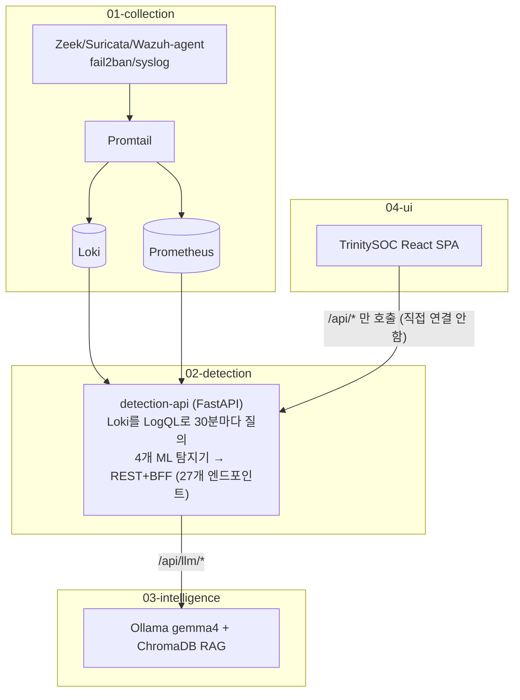
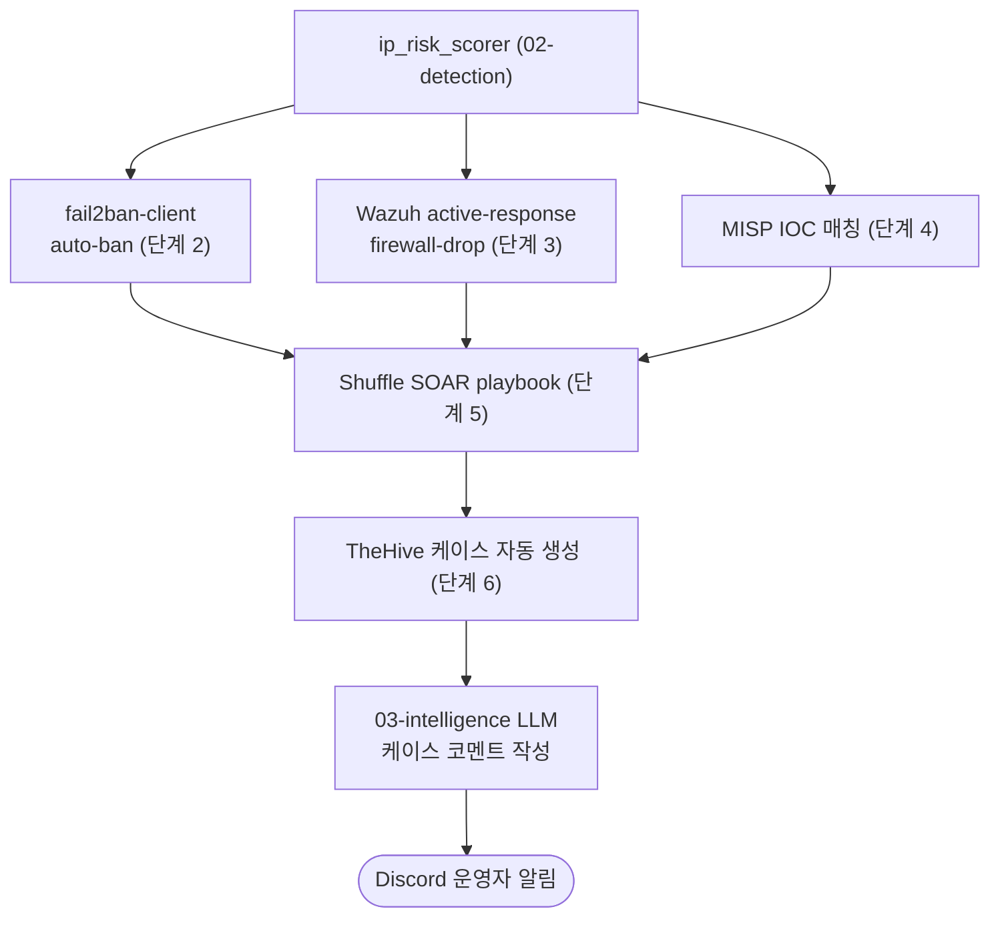

# Architecture — SIEM-Trinity

> 이 문서는 저장소 루트의 5축 문서 세트 중 하나다. 더 상세한 내부 설계는 `docs/architecture.md`(수집~알림 파이프라인) 및 `04-ui/docs/ARCHITECTURE.md`(UI 레이어)에도 있으니 함께 참고할 것.

## 1. 파이프라인 개요

## 2. XDR 대응 단계 (프로필 게이팅, 기본 비활성)
`ip_risk_scorer`에서 분기: fail2ban / Wazuh 능동 대응 / MISP IOC 조회 / Shuffle 웹훅 / TheHive 케이스 생성 — 전부 `01-collection/docker-compose.yml`에 `profiles: ["misp"|"shuffle"|"thehive"]`로 추가되어 기본적으로 기동되지 않는다.

## 3. 포트 (docs/access.md 기준, 전부 `HOST_BIND_IP` 환경변수로 매개변수화)
| 서비스 | 포트 |
|---|---|
| Loki | 3100 |
| Grafana | 3000 |
| Prometheus | 9090 |
| Wazuh | 1514/1515/55000 |
| detection-api | 2027 |
| Ollama | 11434/11435 |
| Streamlit | 8501 |
| TrinitySOC nginx | 5173 (유일한 외부 노출 의도 포트) |
| MISP | 8080/8443 |
| Shuffle | 3001/5001 |
| TheHive | 9000 |
| Elasticsearch/OpenSearch | 9200 |

## 4. 기술 스택 (단계별)
- 01: Zeek, Suricata, Wazuh 4.14.3, fail2ban, ufw, ModSecurity, Promtail→Loki 2.9.4/Grafana 10.3.3/Prometheus
- 02: Python 3.12, FastAPI+uvicorn+APScheduler(30분 주기), scikit-learn(Isolation Forest), SciPy(FFT), pandas/numpy
- 03: Ollama(`gemma4:e2b-it-q4_K_M` + `nomic-embed-text`), LangGraph/LangChain ReAct(13개 도구), ChromaDB(ATT&CK 697개 기법), Streamlit
- 04: React 18 + TypeScript strict + Vite 5, ECharts, react-grid-layout, TanStack Query, Zustand, TailwindCSS, nginx 서빙

## 5. 통합 배경 — 2026-05-22 cutover
이 저장소는 `security-log-monitor`, `siem-ai-detector`, `siem-ai-analyst` 3개 레거시 저장소/스택을 하나의 모노레포로 통합한 것이다(`docs/cutover-2026-05-22.md`). 기존 Docker 볼륨을 compose 프로젝트명(`security-log-monitor`)으로 재사용해 데이터 무손실로 이전했다.
