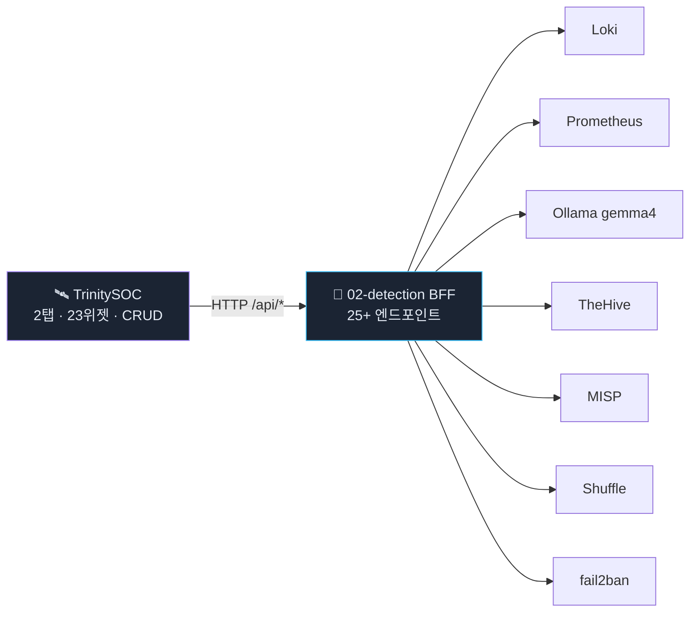
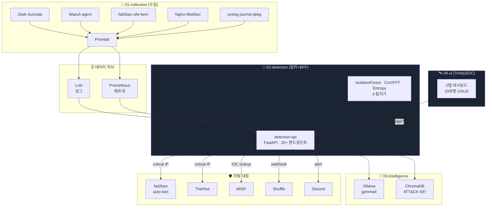

<div align="center">


<br/>

# SIEM-Trinity

### 수집 · 탐지 · 분석 · 대응 + 통합 UI — 4계층 통합 XDR 모노레포

**홈서버 1대 · 오픈소스 0원 · 외부 API 의존 0**

Linux 커널 + Loki + Prometheus + scikit-learn + 로컬 LLM(gemma4) + MISP + Shuffle + TheHive + **자체 React UI(TrinitySOC)** 로 구축한 자작 XDR.

<br/>

`📡 15+ 로그 소스` &nbsp; `🤖 ML 탐지 4종 + ATT&CK 자동 태깅` &nbsp; `🧠 LLM RAG 분석` &nbsp; `🛡️ 자동 대응 체인 6단계` &nbsp; `🛰️ 자체 UI (2탭 · 23위젯 · CRUD)`

<br/>

[](https://grafana.com/oss/loki/)
[](https://prometheus.io)
[](https://wazuh.com)
[](https://python.org)
[](https://fastapi.tiangolo.com)
[](https://scikit-learn.org)
[](https://ollama.com)
[](https://langchain-ai.github.io/langgraph)
[](https://react.dev)
[](https://echarts.apache.org)
[](https://docs.docker.com/compose)

<br/>


</div>

---

> [!NOTE]
> **SIEM-Trinity**는 자작 XDR 스택의 **4계층** — 수집(`01`) · 탐지+BFF(`02`) · 분석(`03`) · UI(`04`) — 와 **XDR epic #4 6단계** (Wazuh agent → fail2ban auto-ban → active-response → MISP → Shuffle → TheHive) 를 한 모노레포에 통합.
> 4계층은 각각 독립 디렉토리 + 독립 docker-compose. 공통 데이터 허브는 **Loki** (로그) + **Prometheus** (메트릭).
> Grafana 는 **선택사항** — 옛 마스터 대시보드 4종을 04-ui (TrinitySOC) 가 흡수했으므로 메인 UI 가 아니다. 고급 ad-hoc 분석 시 backup 으로 활용 가능.

> [!IMPORTANT]
> **이 README가 단일 진실 출처(SSOT).** 레이어별 상세는 각 폴더의 README, UI 는 [`04-ui/README.md`](04-ui/README.md), 통합 아키텍처는 [docs/architecture.md](docs/architecture.md).

> [!WARNING]
> **지원 플랫폼: Linux x86_64 (Ubuntu/Debian).** macOS·Windows·ARM64 비지원 — fail2ban·UFW·systemd·auditd·node-exporter 가 Linux 전용.

---

## 🎯 한 줄로

> **SIEM(로그 → 탐지) + EDR(엔드포인트) + SOAR(자동대응) + 케이스 관리(TheHive) + LLM 분석(gemma4) + 자체 UI(TrinitySOC) — 전부 한 머신에서 한 리포로.**

---

## 🏗️ 4계층 모노레포 구조

```
SIEM-Trinity/                       (private, 1.9 MB 코드)
├── 01-collection/      14% · 1,600 LoC   # 수집 인프라
│   ├── Loki + Promtail (로그) + Prometheus + node-exporter (메트릭)
│   ├── Wazuh manager (HIDS)
│   ├── Grafana (선택 — 04-ui 가 흡수, 백업 도구로만)
│   └── 15+ 로그 소스 (Zeek · Suricata · auth · fail2ban · kern · modsec · ...)
│
├── 02-detection/       27% · 3,136 LoC   # 탐지 엔진 + BFF
│   ├── 4 ML 탐지기 (beacon · DGA · flow · IP risk)
│   ├── FastAPI BFF — 25+ 엔드포인트
│   ├── 자동 대응 클라이언트 (auto_ban · misp · shuffle · thehive · attack_map)
│   └── APScheduler 30분 자동 실행
│
├── 03-intelligence/    16% · 1,867 LoC   # LLM 분석 모듈 + Ollama 런타임
│   ├── Ollama (gemma4:e2b-it-q4_K_M + nomic-embed-text)
│   ├── LangGraph Agent + ChromaDB RAG (ATT&CK 697 techniques)
│   └── ad-hoc Python 모듈 (agent · rag_chain · knowledge_loader)
│
└── 04-ui/              43% · 4,815 LoC   # TrinitySOC — 통합 콘솔
    ├── React 18 + TypeScript strict + Vite 5
    ├── ECharts + react-grid-layout (드래그·CRUD)
    ├── 2탭 (🛡 보안 14위젯 · 🖥 인프라 9위젯)
    └── nginx 정적 서빙 + /api 프록시
```

> **04-ui** 는 이전엔 별도 리포 `kangminlog/TrinitySOC` 였으나 **2026-05-21 git subtree** 로 통합 (모든 커밋·태그 보존).

---

## 🧭 Observability 3축 위에서의 정체성

| 도메인 | 영문 | 비중 | 안에서 |
|---|---|---|---|
| 🛡 보안 | **Security Observability** (SIEM+EDR+SOAR+XDR) | **90%** | 본업 |
| 🖥 인프라 | Infrastructure Observability | 10% | 부속 (Prometheus 기반 인프라 탭) |
| 🧪 애플리케이션 | APM | 0% | 부재 (해당 영역 안 다룸) |

→ **SIEM ⊕ EDR ⊕ SOAR + Case 의 umbrella = XDR.** 이 정체성이 04-ui 의 2탭 + 25+ BFF 로 구현됨.

---

## 🏃 빠른 시작

**Ubuntu 24.04 x86_64 + Docker 28+ 가정.**

### 1. 사전 조건 (한 번만)

```bash
# Docker (공식 repo 권장)
curl -fsSL https://get.docker.com | sudo sh
sudo usermod -aG docker $USER && newgrp docker

# Elasticsearch / OpenSearch 필수 커널 파라미터
sudo sysctl -w vm.max_map_count=262144
echo 'vm.max_map_count=262144' | sudo tee /etc/sysctl.d/99-elasticsearch.conf

# Node.js 20+ (04-ui 빌드용)
curl -fsSL https://deb.nodesource.com/setup_20.x | sudo bash -
sudo apt install -y nodejs
```

### 2. 클론 + 환경 변수

```bash
git clone https://github.com/adorahelen/siem-trinity-public.git
cd siem-trinity-public
cp .env.example .env
# .env 편집: HOST_BIND_IP, MISP_ADMIN_PASSWORD, THEHIVE_SECRET 등
```

### 3. 4계층 기동

```bash
# 01: 수집 인프라 (Loki + Promtail + Prometheus + node-exporter + Wazuh)
docker compose -f 01-collection/docker-compose.yml up -d
# Grafana 는 선택. 백업·심층 ad-hoc 용으로 같이 띄우려면 동일 compose 가 함께 기동.

# 02: 탐지 + BFF
docker compose -f 02-detection/docker-compose.yml up -d

# 03: LLM 런타임 (Ollama)
docker compose -f 03-intelligence/docker-compose.yml up -d
docker exec intelligence-ollama ollama pull gemma4:e2b-it-q4_K_M
docker exec intelligence-ollama ollama pull nomic-embed-text

# 04: TrinitySOC UI
cd 04-ui
npm install && npm run build
cd deploy && docker compose up -d
```

### 4. 접속

```
TrinitySOC (메인 콘솔):     http://<HOST_BIND_IP>:5173
detection-api BFF:          http://<HOST_BIND_IP>:2027/api/status
Grafana (선택, 백업·ad-hoc): http://<HOST_BIND_IP>:3000  (admin/admin)
```

### 5. (선택) XDR 풀스택 활성화

```bash
# MISP + Shuffle + TheHive (한 번에)
docker compose -f 01-collection/docker-compose.yml \
  --profile misp --profile shuffle --profile thehive up -d
```

자세한 절차 → [docs/install-production.md](docs/install-production.md) · [docs/xdr-step*](docs/)

---

## 🛰️ TrinitySOC — 통합 운영자 콘솔 (`04-ui/`)

[](04-ui/)

흩어진 6개 도구 UI (Grafana · detection-api · Streamlit · TheHive · MISP · Shuffle) 를 **하나의 다크 콘솔**로. 위젯을 사용자가 직접 드래그·추가·편집·삭제·리사이즈.



| 탭 | 기본 위젯 |
|---|---|
| 🛡 **보안** (14) | KPI 6 (fail2ban·Wazuh·Suricata·TheHive 케이스·SSH 실패·XDR 토글) · 시계열 2 · Top-K 3 (공격IP·차단IP·DNS) · 로그 2 |
| 🖥 **인프라** (9) | KPI 4 (CPU·메모리·디스크·가동시간) · 시계열 2 (I/O·네트워크) · 정보 4 (네트워크·스토리지·포트·센서) |

자세히 → [04-ui/README.md](04-ui/README.md) · [04-ui/docs/ARCHITECTURE.md](04-ui/docs/ARCHITECTURE.md) · [04-ui/docs/WIDGETS.md](04-ui/docs/WIDGETS.md)

---

## 🔄 데이터 흐름



---

## 🛡️ 자동 대응 체인 (XDR Response Layer)

| 단계 | 조건 | 동작 | 코드 |
|---|---|---|---|
| **1. 탐지** | beacon/DGA/flow/IP risk 점수 ≥ 임계값 | alert JSONL append + Discord | `02-detection/alert_manager.py` |
| **2. 자동 차단** | IP risk = Critical (≥90) & `AUTO_BAN_ENABLED=true` | `fail2ban-client set siem-trinity banip <IP>` | `02-detection/auto_ban.py` |
| **3. 능동 대응** | Wazuh agent rule trigger | `firewall-drop` / `host-deny` / `disable-account` | Wazuh active-response |
| **4. 위협 인텔** | 탐지 IP/도메인 | MISP IOC 매칭 → score 가산 (15점) | `02-detection/misp_client.py` |
| **5. 워크플로** | Critical 사건 | Shuffle webhook → 자동화 라인 실행 | `02-detection/shuffle_client.py` |
| **6. 케이스** | Critical IP | TheHive 케이스 자동 생성 + LLM 코멘트 | `02-detection/thehive_client.py` |

**현재 상태**: 6단계 모두 **코드 구현 완료**. 토글 4개 (`.env` 의 `AUTO_BAN_ENABLED` · `MISP_ENABLED` · `SHUFFLE_ENABLED` · `THEHIVE_ENABLED`) 기본 OFF. dry-run 후 ON.

---

## 📂 레이어별 README

- [`01-collection/README.md`](01-collection/README.md) — SIEM 인프라 + XDR profile 3종 (15+ 로그 소스 · Discord 알림 · MISP/Shuffle/TheHive 활성화)
- [`02-detection/README.md`](02-detection/README.md) — AI 탐지 4종 + 자동 차단 클라이언트 4종 + FastAPI BFF 25+ 엔드포인트
- [`03-intelligence/README.md`](03-intelligence/README.md) — LLM Agent + RAG + ATT&CK 임베딩 + TheHive 케이스 코멘트
- [`04-ui/README.md`](04-ui/README.md) — **TrinitySOC** 통합 운영자 콘솔 (React 18 + 2탭 위젯 대시보드)

각 레이어 README는 그 레이어 내부 컴포넌트만 다룹니다. 통합 아키텍처는 이 README + [docs/architecture.md](docs/architecture.md).

---

## 🖥️ 지원 환경 / 운영 자원

| 자원 | 권장 |
|---|---|
| CPU | x86_64 8 cores+ (Ryzen 5 5500GT / Ryzen 9 9950X3D VM 등 검증됨) |
| RAM | 16 GB+ (Ollama gemma4 가 ~5 GB) |
| 디스크 | 40 GB (시나리오 B — LLM 포함) / 60 GB (풀 XDR) |
| OS | Ubuntu 22.04+ / Debian 12+ (x86_64) |
| 네트워크 | 인터넷 (이미지 pull·MISP feed·LLM 모델 pull) |

**디스크 분류 참고**: Issue #71

---

## 🚀 배포 모델

| 모드 | 누가 | 어디서 |
|---|---|---|
| **시나리오 A — 시연** | 데모 보기만 | docker compose up · 합성 데이터 (`siem-replay`) |
| **시나리오 B — 개인 운영** | 본인 홈서버 1대 | 풀 4계층 + gemma4 + 토글 단계별 ON |
| **시나리오 C — 검증·테스트** | 새 환경 검증 | 232 같은 VM 으로 dry-run 후 운영 적용 |

자세히 → [docs/install-production.md](docs/install-production.md)

---

## 🔍 사실 검증 가이드

```bash
# 4계층 헬스
curl http://<HOST>:5173/api/health/all | jq

# 탐지 즉시 실행
curl -X POST http://<HOST>:2027/api/run

# 위험 IP 스코어링 (24h)
curl 'http://<HOST>:2027/api/alerts?detector=ip_risk_scorer&limit=20'

# TrinitySOC 접속 (메인 콘솔)
open http://<HOST>:5173
```

전체 시나리오 → [docs/xdr-step*-*.md](docs/)

---

## 🛠️ 모노레포 운영

### 히스토리

| 시점 | 사건 | 비고 |
|---|---|---|
| 2026-05-13 | 3 레포 통합 (`security-log-monitor` · `siem-ai-detector` · `siem-ai-analyst`) | `git subtree`, 91 커밋 보존 |
| 2026-05-19 ~ 21 | XDR epic #4 6단계 완료 (PR #24 → #76) | 토글 4종 추가 |
| 2026-05-20 | TrinitySOC 신규 개발 (별도 리포로 시작) | 13 위젯 · CRUD · 2탭 |
| **2026-05-21** | **TrinitySOC → `04-ui/` subtree 통합** | **현재 4계층 단일 모노레포** |

> 기존 4 개 구 리포는 archive 로 유지 (삭제 안 함):
> `security-log-monitor` · `siem-ai-detector` · `siem-ai-analyst` · `TrinitySOC`

### 체크포인트 (git tag)

```bash
checkpoint/pre-tabs-bff             # 탭 분리 작업 전 BFF 상태 (TrinitySOC 별도 리포 시절)
checkpoint/pre-readme               # README 재작성 직전
checkpoint/docs-trinitysoc-section  # TrinitySOC 섹션 추가
checkpoint/pre-ui-merge             # subtree 머지 직전
checkpoint/monorepo-v1              # 4계층 통합 직후
checkpoint/pre-ui-cleanup           # 옛 UI 제거 전
checkpoint/ui-cleanup-done          # 옛 UI 제거 후
checkpoint/dead-code-cleanup        # 잔여 dead code 제거 후
checkpoint/readme-v3                # README v3 (이 문서 직전)
```

언제든 롤백:
```bash
git checkout -b rollback checkpoint/<tag>
```

### Git 정책

- `main` 직접 push 금지. 모든 변경은 PR.
- 브랜치 prefix: `feat/` · `fix/` · `docs/` · `chore/` · `refactor/`
- 한 PR = 한 가지 문제 (CLAUDE.md §1.3 Surgical edits)
- 자동 대응 변경 (auto-ban·active-response) 은 dry-run 토글 OFF 기본값 필수

자세히 → [CLAUDE.md](CLAUDE.md)

---

## 🤝 라이선스 / 크레딧

오픈소스 스택만 사용. 외부 API 의존 없음. 모든 데이터 자가 호스팅.

| 도구 | 라이선스 |
|---|---|
| Loki / Grafana / Promtail | AGPL-3.0 |
| Prometheus / node-exporter | Apache-2.0 |
| Wazuh | GPL-2.0 |
| Suricata / Zeek | GPL-2.0 / BSD-3 |
| Ollama / gemma4 | MIT / 모델별 |
| MISP / TheHive | AGPL-3.0 |
| Shuffle | AGPL-3.0 |
| React / TypeScript | MIT |

전체 → [docs/credits.md](docs/credits.md)

---

## 🔗 관련 리포 (archive)

- TrinitySOC — 04-ui 의 본가 (subtree 머지 후 archive 보존, 비공개)
- [adorahelen/siem-trinity-public](https://github.com/adorahelen/siem-trinity-public) — sanitize 공개 스냅샷 (이 리포 → public 단방향)

---

<div align="center">

**4계층 · 단일 모노레포 · 0 외부 의존 · 0 비용**


</div>
