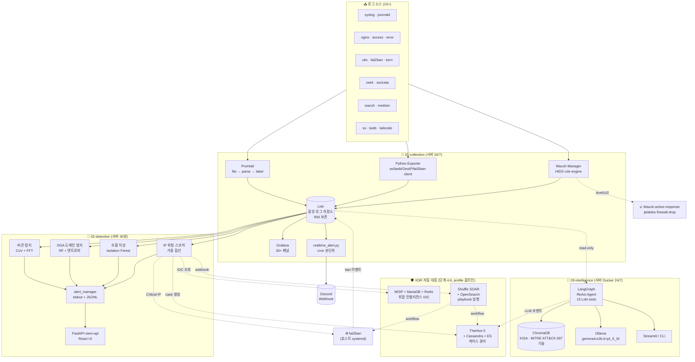

# SIEM-Trinity Architecture

> 통합 아키텍처 상세. 요약은 루트 [README.md](../README.md) 참조.
> XDR epic #4 완료(2026-05-19)로 단계 4-6 (MISP/Shuffle/TheHive) 추가됨.

---

## 1. 레이어 분리 원칙

| 원칙 | 적용 |
|---|---|
| **단일 데이터 허브** | 모든 레이어가 Grafana Loki HTTP API로만 통신. 레이어 간 직접 코드 의존 없음. |
| **레이어별 독립 배포** | 01·02·03 모두 서버 Docker. 한 레이어를 끄거나 교체해도 나머지 영향 없음. |
| **읽기 전용 다운스트림** | 02·03은 Loki를 **read-only**로만 접근. 로그 생산은 01만 담당. |
| **자동 ↔ 사람** | 01·02는 자동 가동. 03은 사람이 켤 때만. |
| **XDR 자동화 격리** | 단계 4-6 (MISP/Shuffle/TheHive) 은 `profiles: ["misp"/"shuffle"/"thehive"]` 로 옵트인. 기본 compose 에 미포함. |
| **자동 차단 기본 OFF** | `AUTO_BAN_ENABLED`, `MISP_ENABLED`, `SHUFFLE_ENABLED`, `THEHIVE_ENABLED` 모두 `.env` 토글로 활성화. 운영자 자기 차단 1순위 리스크 (CLAUDE.md §5.3). |

---

## 2. 전체 데이터 흐름

> **단계 4-6 의 흐름**: ip_risk_scorer 가 Critical(≥90) IP 를 발견하면 4 경로 동시 트리거 — fail2ban 직접 차단 / MISP IOC 매칭 / Shuffle workflow / TheHive 케이스 생성. 단계별 활성화 토글은 `.env` 의 4개 env 로 제어.

---

## 3. 컴포넌트 ↔ 포트 ↔ 데이터

| 레이어 | 컴포넌트 | 포트 (HOST_BIND_IP) | 데이터 |
|---|---|---|---|
| 01 | Loki | 3100 | 로그 저장 (TSDB) |
| 01 | Grafana | 3000 | 시각화 |
| 01 | Prometheus | 9090 | 메트릭 |
| 01 | Wazuh Manager | 55000 / 1514 / 1515 (127.0.0.1) | HIDS rule 매칭 + active-response |
| 02 | detection-api (FastAPI) | 2027 | 탐지 결과 API + React UI |
| 03 | intelligence-ui (Streamlit) | 8501 | UI + LangGraph Agent |
| 03 | intelligence-ollama | 11434 | LLM 추론 (gemma4:e2b-it-q4_K_M) |
| **XDR-4** | **MISP web** | **8443 (HTTPS) / 8080** | **위협 인텔리전스 IOC** (profile `misp`) |
| **XDR-5** | **Shuffle frontend** | **3001** | **SOAR playbook UI** (profile `shuffle`) |
| **XDR-5** | **Shuffle backend API** | **5001** | **workflow 실행** |
| **XDR-6** | **TheHive web/API** | **9000** | **케이스 관리** (profile `thehive`) |

---

## 4. 보안 경계

- **외부 노출**: 모든 포트가 `HOST_BIND_IP` (기본 127.0.0.1) 에만 바인딩. Tailscale 또는 LAN 노출 시 명시적 IP 지정.
- **외부 API 호출**:
  - 03-intelligence: 로컬 Ollama 만 (OpenAI/Anthropic 0회)
  - **단계 4 MISP**: 위협 인텔 피드 fetch (abuse.ch / AlienVault OTX 등) — 외부 → 내부 단방향 다운로드만
  - 외부로 송신: Discord webhook (01 + 단계 5 Shuffle 옵션)
- **GeoIP 조회**: 01의 exporter가 ip-api.com 을 호출.
- **자동 차단 안전장치**:
  - Tailscale CGNAT `100.64.0.0/10` + 사설망 + localhost 항시 화이트리스트 (Wazuh `<white_list>`)
  - `AUTO_BAN_WHITELIST_IPS` env 로 운영자 IP 추가 명시
  - 모든 자동 동작은 기본 OFF, env 토글로 활성화

## 5. 자동 대응 체인 (XDR 단계 1-6)

루트 [README.md §🛡️ 자동 대응 체인](../README.md#%EF%B8%8F-자동-대응-체인) 참조. 활성화 토글:

| Env | 단계 | 효과 |
|---|---|---|
| `AUTO_BAN_ENABLED` | 2 | ip_risk_scorer Critical → fail2ban-client banip |
| (config 주석 해제) | 3 | Wazuh active-response → iptables firewall-drop |
| `MISP_ENABLED` | 4 | ip_risk_scorer 가 MISP IOC 매칭으로 +30 점 |
| `SHUFFLE_ENABLED` | 5 | Critical 사건을 Shuffle webhook 으로 위임 |
| `THEHIVE_ENABLED` | 6 | Critical IP → 케이스 자동 생성 + ATT&CK tag |

---

## 6. 검증 명령

루트 README의 [🛡️ 자동 대응 체인](../README.md#%EF%B8%8F-자동-대응-체인) 참조.
